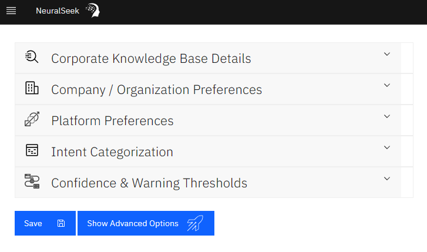
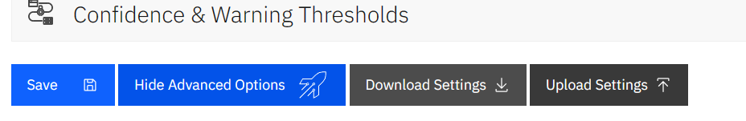
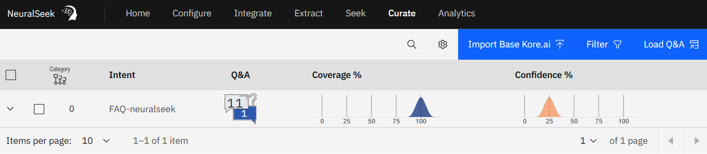
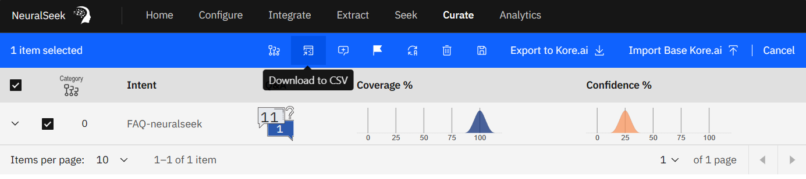
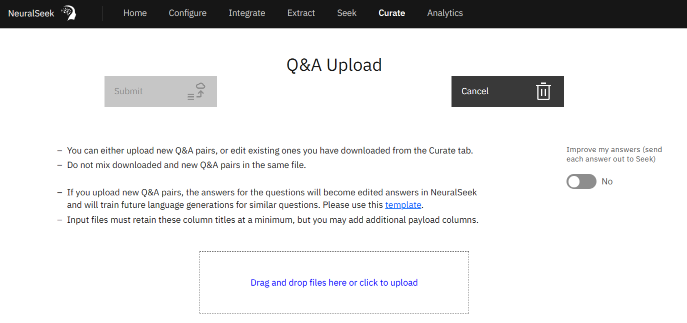

# Backup and Restore 

### This document outlines available options for backing up and restoring NeuralSeek instance data. 

## Backup and Restore Settings
1. Open NeuralSeek's Configure tab, and select "Show advanced options" (if not already shown):

2. From here, you are now offered the option to download/backup and upload/restore your instance settings.

## Curated Data (Backup)
1. Open NeuralSeek's Curate tab

2. Select some, or all, curated intents to backup

3. As seen above, upon selecting curated intents, you are offered a "Download to CSV" button. This is useful not only for backing up your curated data, but also for allowing subject matter experts to edit curated Q&A content without direct access to the UI. After editing, you're able to re-upload the curated content in the next set of steps (Restore).

## Curated Data (Restore)
1. When no intents are selected, you are offered a "Load Q&A" button near the top-right:

2. This takes us to the Q&A Upload page:

3. From here, we are able to upload a Curated Q&A CSV file (downloaded from previous steps). For Restoring purposes, you will not want to use "Improve my answers".

## Data Policy
All user data and generated answers are owned by and for the sole use of the customer. 

It is your responsibility to regularly backup curated content. There is no option to configure product availablilty at this time.
 
