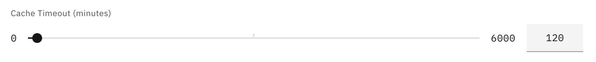
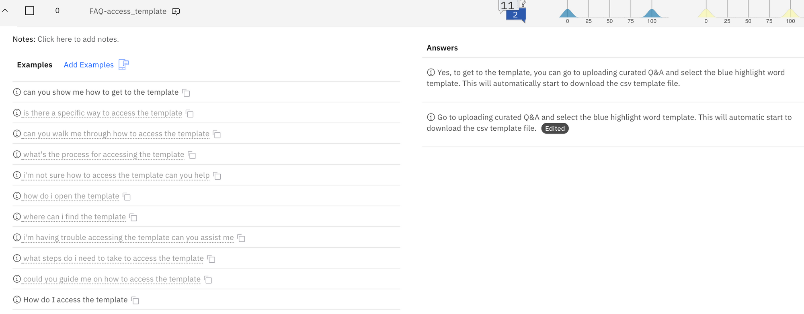
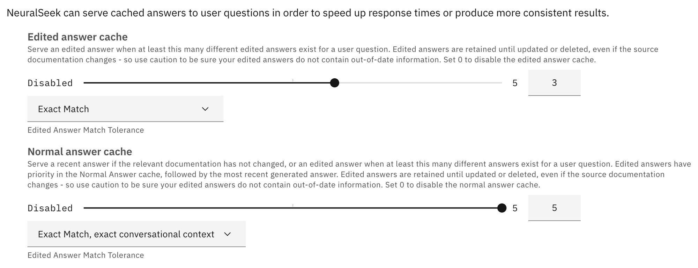
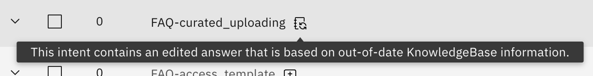
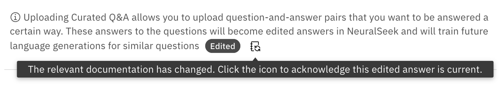
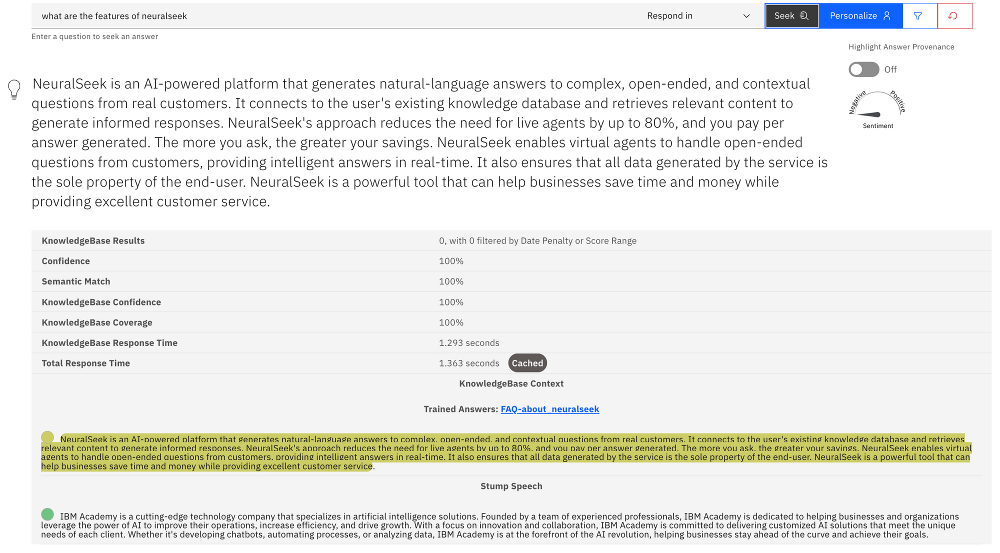

# Caching

## What is it?
NeuralSeek uses [caching](https://en.wikipedia.org/wiki/Cache_(computing)) strategy in two areas (Corporate KnowledgeBase and Answer) to enhance performance and reduce computational cost during its operation.

1. The first part is when NeuralSeek searches through corporate knowledge base to obtain the original information. You can set the cache duration of such those responses to be cached, so that the original information’s retrieval time can be reduced.
2. NeuralSeek then utilizes two types of caches for both your edited answers and generated answers that can serve cached answers to user questions in order to speed up response times and product more consistent results.

## Why is it important?
Caching frequently returned answers save both time and computation cost to run virtual agents, as it reduces NeuralSeek to having to generate responses repeatedly, especially on the more frequently asked questions or seldom updated answers.

## How does it work?

### Corporate KnowledgeBase Cache
When NeuralSeek accesses the Corporate KnowledgeBase, it processes the original data from it, cleanses its contents (e.g. removing unnecessary contents, filtering, deduplicating, etc.), compresses it, and prioritize the returned contents which is then processed with LLM (Large Language Model) to form the completed response, usually at the range of 8,000 ~ 9,000 characters. It then derives a hash value of that response window which acts as a check to later see if the original data is updated. This response is what actually gets cached within the NeuralSeek, so that all those search, processing, and LLM-generated time is effectively saved when the same answer needs to be derived.

Under the `Configure > Corporate KnowledgeBase Details` section, user can set the duration of the cache measured in minutes to control how long these responses need to be cached.

### Answer Cache
When the user asks question to NeuralSeek, it tries to use the question to find the matching ‘intent’ of the question. And when the matching intent is discovered (usually via a fuzzy matching), the provided answer, either normal or user edited, can then be cached.

Under the `Configure > Intent Matching & Cache Configuration` section, you can enable or disable the edited answer cache or normal answer cache, and set the following parameters to control how it works:

Each cache type (edited answer, normal) would have the answer threshold bar and edited answer match tolerance. You can adjust the threshold to control when the caching will start caching for the answer, depending on how many answers exist for a given user question. For example, if you set the threshold to 5, the caching will not start until there exist 5 or more different answers to the given question. Setting the threshold to 1 would let NeuralSeek start caching as soon as it sees at least a single answer exists. Setting the value to 0 will disable caching completely.

The matching method (Exact Match, Fuzzy Match, etc.) is the method you can specify to tell NeuralSeek on how to perform the intent matching on the question.

There is also a more advanced matching method of ‘Exact Match, exact conversational context’ on the normal answers that would try to find the match if the consecutive conversation (e.g. one and the one after) both have the matching result, so that the match could be more correct in terms of how the conversation flow is occurring.

In terms of the edited answers, this ‘conversational context’ matching is not provided given that the edited answers should be more concise and based on a more substantial ground and thus should not rely on the conversational context.

### Detecting changes in the original source
In order to make sure the cached answers retain the authenticity, every cached answers are fed into an hashing algorithm to generate a unique hash key, which is then compared with the original source to detect whether the original source has been altered or not.

If the hash keys do not match, NeuralSeek will notify users that the answers are not up-to-date with what’s found in the KnowledgeBase. This would happen when a particular answer is being used during the Seek time, so that the answer would be kept in check with the original.

User can then take a look at the outdated answer, and can either delete and re-load it, or edit it and then mark it as current, so that NeuralSeek will be able to check it off from its outdated list.

> One other way the answer would be checked is when NeuralSeek is handling round trip logging. During that time, NeuralSeek would check which answers are getting frequently returned and also perform an asynchronous checks with the KnowledgeBase to make sure they are up-to-date.

### How do we know the answers are coming from cache?
You can check whether your query matched and returned the cached answer in the `Seek` tab. For example, this is an example of the answer returned from the cache.

Next to the `Total Response Time`, you will see a label `Cached` which indicate that the answer came straight from the cache.

