# Curation Of Answers

## What is it?
NeuralSeek is directly trained off of the documentation loaded into the KnowledgeBase. If there is undesired answers from NeuralSeek, the first step is to review the documentation within the KnowledgeBase, and effectively curate the answer which can then be used by NeuralSeek to training itself better the next time it answers.

## Why is it important?
One of the key factors in reducing costs is the utilization of curated answers sourced from a pool of responses, which proves to be more economical. Also, when the collection of answers becomes stagnant, potentially leading to outdated information, this feature will be able to detect it and refresh those with less manual process.

## How does it work?
To tackle this challenge, NeuralSeek provides a solution by automatically monitoring the sources of information. It continuously tracks and compares the generated responses with the source documents to determine if any changes have occurred. By doing so, NeuralSeek ensures that the answers remain up-to-date and relevant. This eliminates the need for manual intervention and the potential for outdated information, allowing users to trust the accuracy and currency of the answers provided.

### Curating Intents and Answers
Let's first visit the UI page for curating intents and answers. Click `Curate` tab on the top menu.
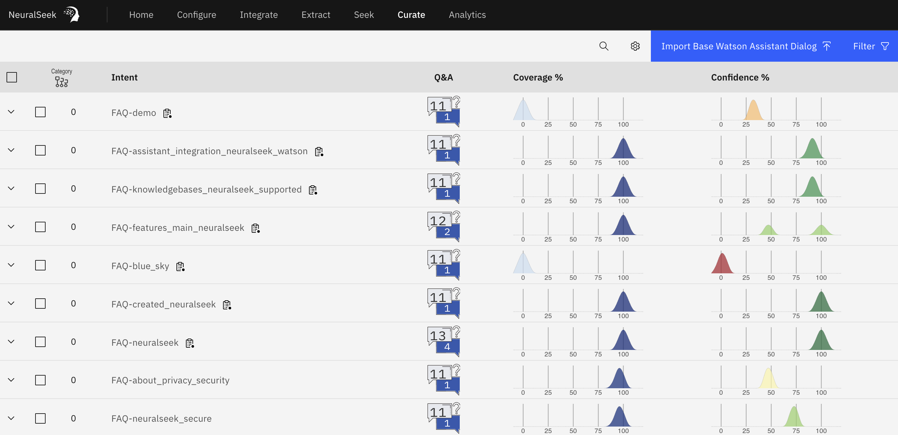
The UI is composed of two the following columns:
- Intent - Intents are collection of questions that may be related to the similar `intent` of the question. It is prefixed by certain type of intents such as `FAQ`, followed by the question's subject areas. By default, all the intents do fall under a category `Others`, but You can also define your own category in NeuralSeek's configuration.
  - Intents also have number of indicators that help users to understand the status of the intent. For example, it can show whether the intent has any new answers, whether the intent contains any PII (personally identifiable information), or whether the intent's underlying data has been outdated, etc.
- Q&A - Shows the number of questions (white dialog icon) and answers (blue dialog icon) that this particular intent contains.
- Coverage % - Indicates how much KnowledgeBase had contributed to the answer's coverage. If NeuralSeek was able to find all the necessary information from the KnowledgeBase, this percentage is going to be very high.
- Confidence % - Indicates how much NeuralSeek its answer is most likely to satisfy the user. If this score is high, it means the answer has a high score of being legitimate and true to the facts.

### Reading the trend
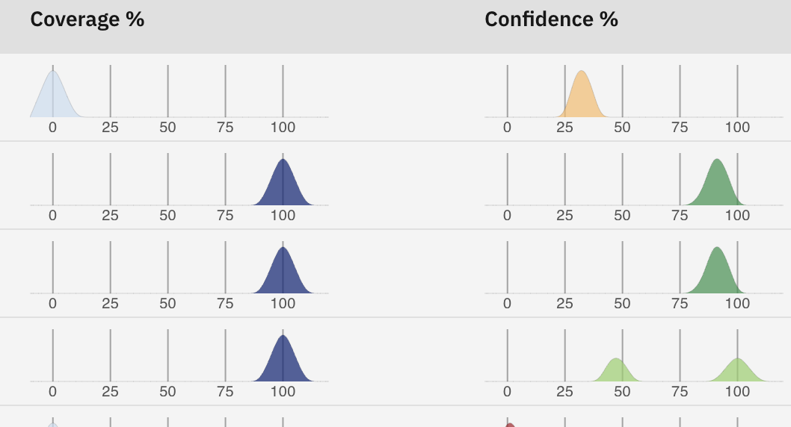
Each of the graph (coverage and confidence) has color codes that lets user visibly understand the state and trend. Coverage uses blue color with intensity that changes as its coverage is low or high. Confidence shows green to display high confidence to red meaning low confidence. You may also notice the slope has different heights, which gets smaller as there are more `changes` on its value.

Hovering over the graph would reveal the trend of changes:
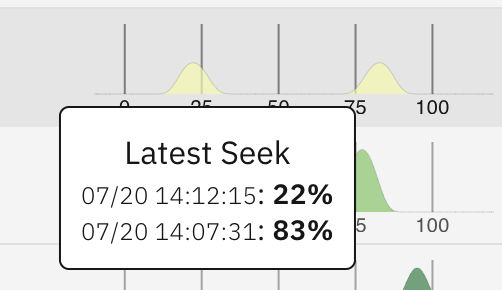

In this case, there were instance of when the confidence had dropped from 83% to 22%, over the period between 14:07:31 to 14:12:15 on July 20th.

### Displaying Intents and Answers
If you click the `⌄` Arrow next to the intent name, you will see the list of example questions and its generated answers:
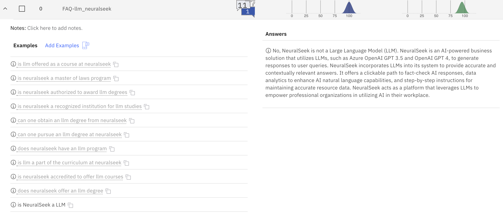

The example questions have either black color or gray color, depending on how they were created. The black colored examples are the ones that were actually submitted by the user's question. NeuralSeek automatically generates similar meaning questions per each question that it receives.

As necessary, you can also enter your own Example question in addition to the ones that NeuralSeek generates.
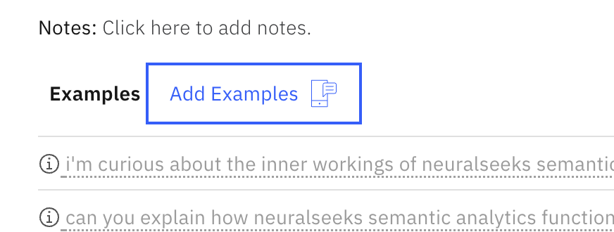

> It is also possible to add Notes that may save additional information regarding this particular intent.

### Searching the intent
The size of intent can vary but could grow over multiple pages, so you may want to search for a particular intent time to time. You could do that by using the search form at the top of the page. Enter the keyword and it will narrow down your search.
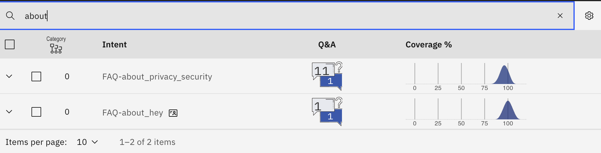

### Filtering the intent
There is more fine-grained way of filtering intents based on critieria such as whether they were edited, or new answer was added, flagged, or out-of-date data was found. click the filter button, set the criterias that you want, and the page will only show the ones that met the filtering condition.
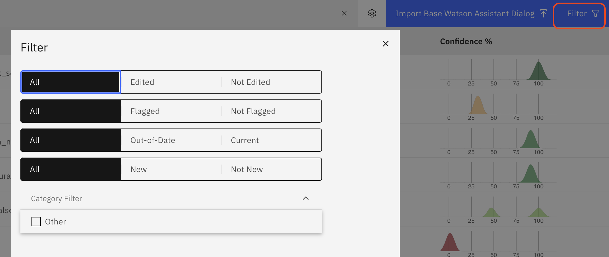

### Editing the Answer
On all the answers generated, you can curate any answer by editing it. One of the reasons why you may need to edit it is because the generated answer could be better by editing, or you could add more details to it that was missing. Edited answer will be saved and will be considered higher priority over non-edited answers, to ensure that what you edited will be picked out first.

Editing can be done by clicking the answer, modifying its content, and saving it.
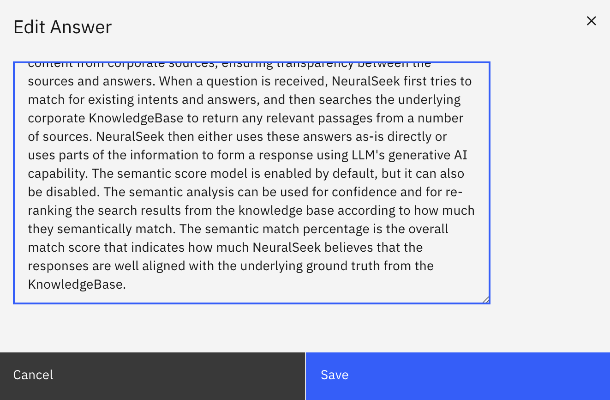

After saving, you will see that the answer that you edited will be marked as `Edited`.
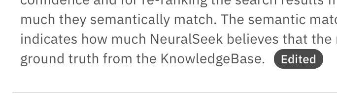

### Deleting Questions and Answers
If you wish to delete either the question or answer under the intent, you can do so by clicking the `circle with i` icon and selecting `Remove`.
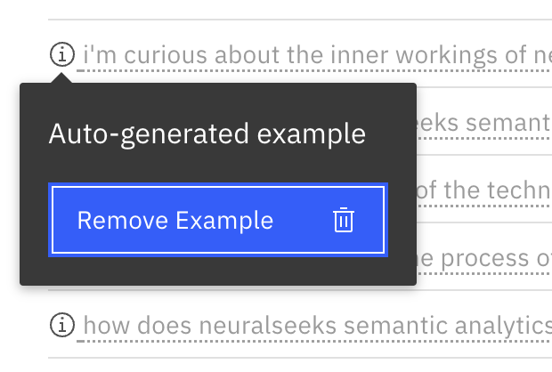

> ⚠️ Once they are removed, there is no way to roll back the removal, so be careful.

### Deleting all data
You can delete all data by selecting the gear icon at the top and selecting:
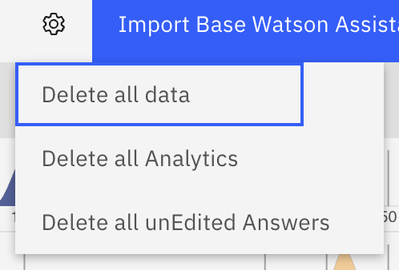
- Delete all data
- Delete all analytics
- Delete all unEdited Answers

These are a useful feature if you wish to simply reset all of these data and start from the scratch.

### Intent operations
When you select an intent, a popup will be displayed which shows you the operations that you can do with the selected intent.
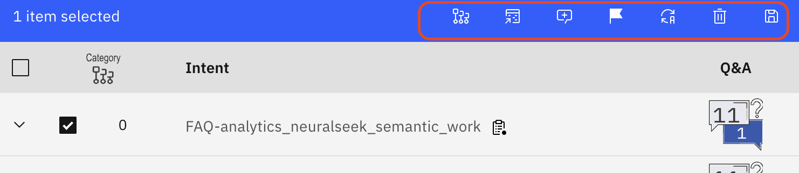
- Edit category - will let you edit the current category
- Download to CSV - will export this into CSV file. It will have the following format: `ID,question,score,kbCoverage,answer,category,intent,pii`
- Generate Convsersation - This will convert the intento into conversation, instead of a simple question and answer. This will give a better context for the NeuralSeek to generate answer from.
- Flag - Will flag the intent so that you can quickly find it later.
- Rename - Will let you rename its name
- Delete - Deletes the selected intent(s).
- Backup - Backs up the intent for later recovery. Note that the backed up file is not a text file, but in binary format.
- Merge - appears only when two or more intents are selected. It merges all of their questions and answers into a single intent.
> There is no option to rollback the merge, so do it with caution.