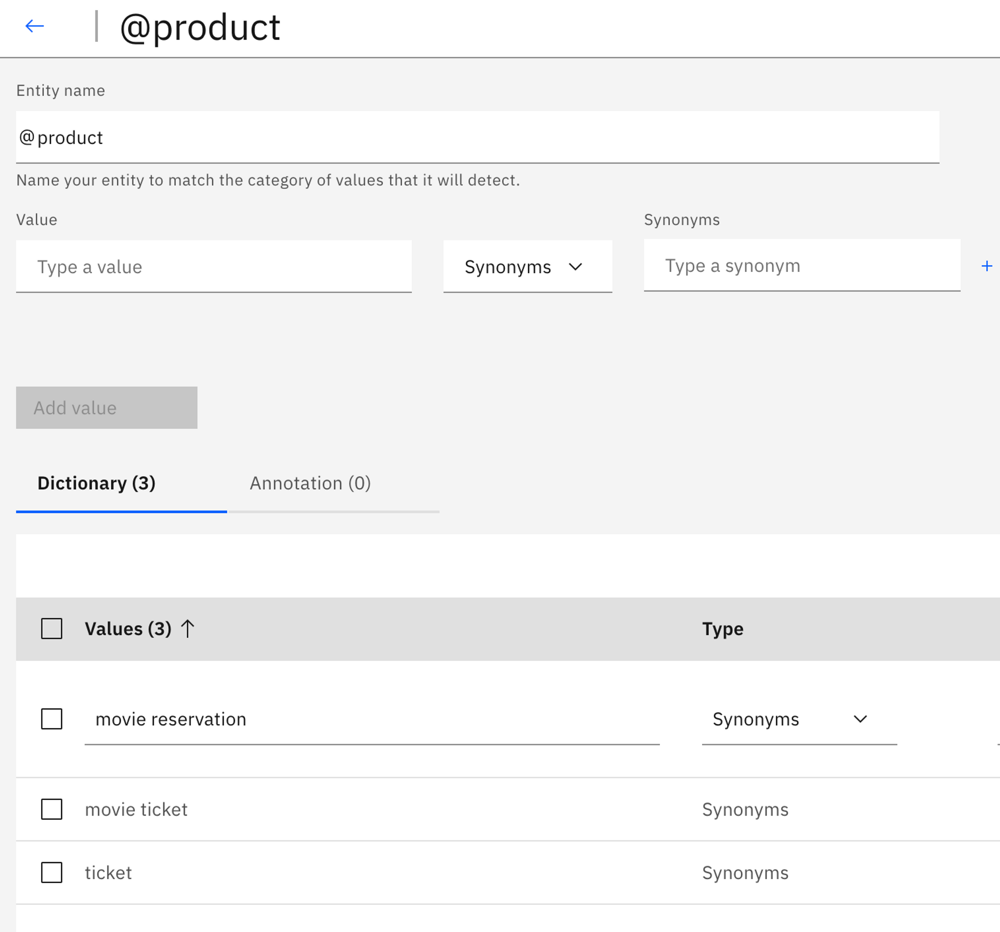
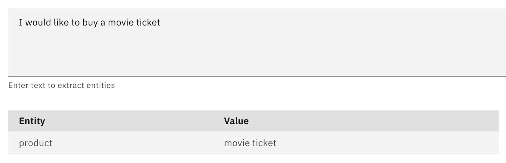
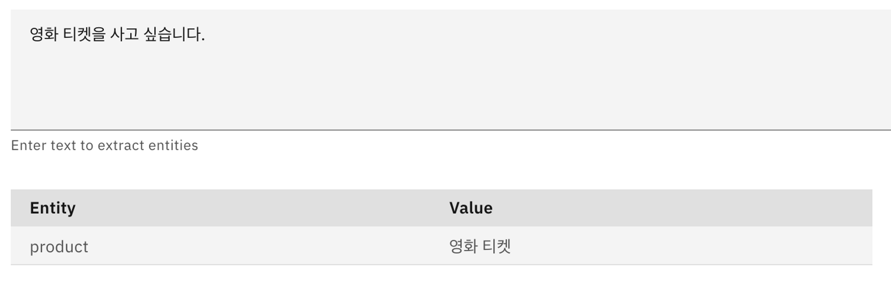
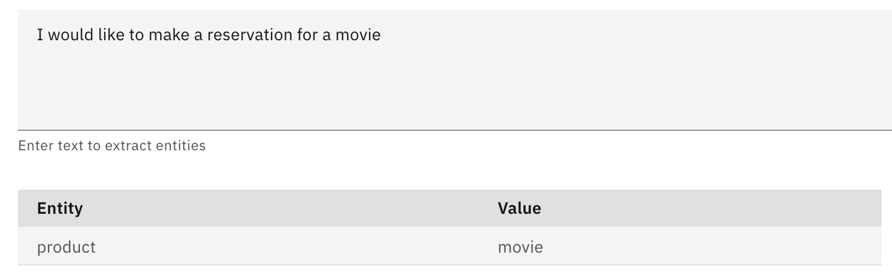
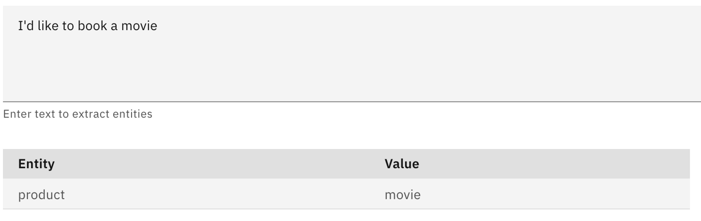
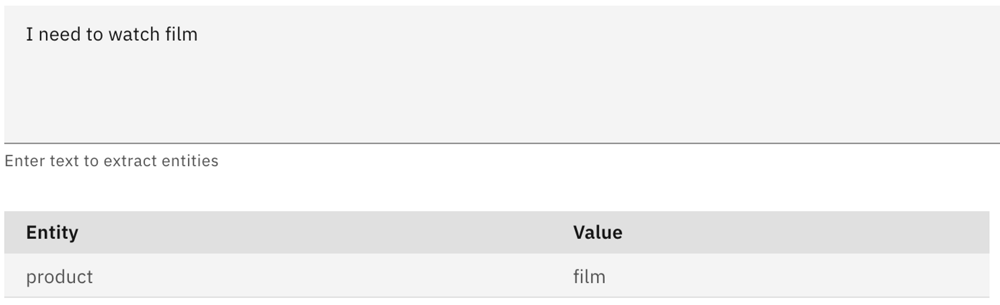
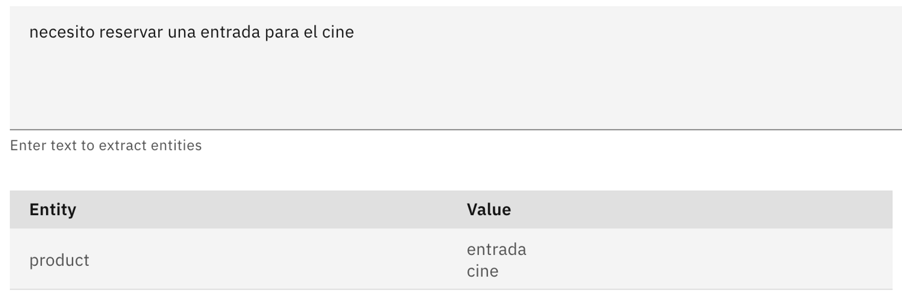
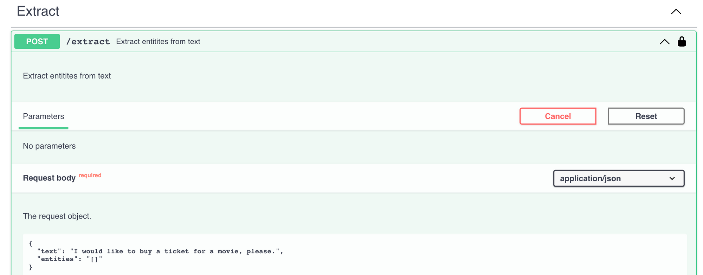
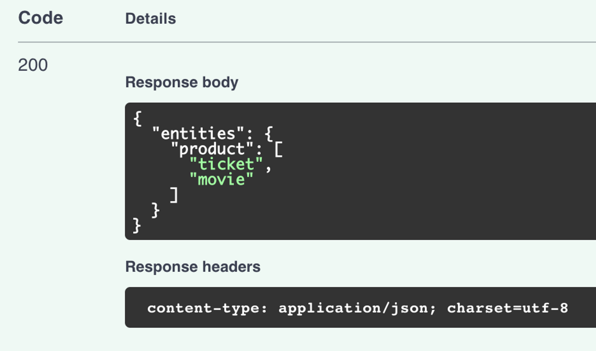

# Entity Extraction

## What is it?
NeuralSeek has a feature called ‘Extract’ which is a service to let user extract entities within a given user text. Users can also define their custom entities and provide description for NeuralSeek to detect and extract entities that are defined by users. The service is provided with a REST endpoint which can be used by external applications such as virtual agent or chat bots to invoke it within their conversational flow to enhance their capabilities to detect entities within it.

## Why is it important?
Virtual Agents can define various ‘entities’, which may have values that needs to be categorized into concepts or types that can play various roles during their request handling. For example, when a user types a question like:

> “I would like to buy a movie ticket.”

The term “movie ticket” could be categorized as “product” that the virtual agent might need to understand so that the agent could start a dialog that would continue like:

> “Sure, what kind of movie ticket do you want to purchase?”

knowing that the user is interested in buying (intent) a movie ticket (product), so the agent should perform an action of providing list of the movies, as well as letting user choose the date and time, and ultimately proceeding with billing and payment.

The inherent challenges in configuring virtual agent is to make sure these entities are accurately identified by providing various patterns or values or an entity type, so that when those words appear in the conversation, such entity could be identified.

An example of that is how IBM Watson Assistant in dialog mode can define entity and its related values as such:

In the above example, the entity ‘product’ would be identified in the dialog if the user mentioned these words such as ‘movie reservation,’ ‘movie ticket,’ or simply ‘ticket.’ Watson Assistant also provides fuzzy matching to match any incorrect spellings or slight deviation from these words to help it better cope with the request.

However, there are obviously clear limitations and caveats in doing this approach.

- You have to provide every possible values necessary for the bot to understand it as certain type of entity. Anything out of the given value might not be categorized at all, or even categorized incorrectly.
- Maintaining a large set of entity and its subsequent values can be costly and time consuming.
- If you have to support multiple languages, you may need to provide all the possible values as legal vocabularies which can then be a pretty challenging feat.

## How does it work?
NeuralSeek’s Entity Extraction uses natural language processing to extract key entities that your virtual agent needs to understand, without requiring you to specify possible values or patterns and having the burden of constantly maintaining it.

### Entity Extraction from conversation
Let’s take a look at the above example of defining a movie ticket as a product. In the tab ‘Extract,’ enter the same text of ‘I would like to buy a movie ticket’ and click ‘Extract’ button.

You will see NeuralSeek, without specifying anything, was able to identify the `movie ticket` as an entity of `product` and properly extracted it from the given string.

Moreover, you can ask the phrase in different languages, and NeuralSeek’s entity extraction will still work, without you doing anything!

### Custom Entities
In case there is a specific way that you need to make to categorize an entity, NeuralSeek provides a simpler and better way to define what your entity is, by using Custom Entity definition.

Using this, Neural Seek can perform entity extraction in much more robust way:

And obviously, this single customer entity definition would work in other languages too!

### Entity Extraction REST API
NeuralSeek’s entity extraction supports integration via REST API, so it make calling the service easy with any external applications such as virtual agents or chatbots. It is easy to test its functionality by using API documentation under `Integrate` tab.

This will return the following JSON type response:

