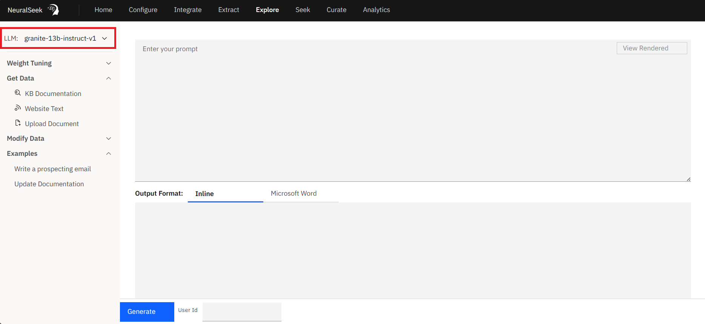

# Explore Platform

## What is it?

NeuralSeek offers a feature called "Explore" which is a versatile and innovative platform, offering an open-ended playground for retrieval augmented generation. It empowers users to seamlessly integrate their preferred Language Model (LLM), select from a range of data sources including Knowledge Bases, websites, local files, or typed text, and employ the NeuralSeek Template Language (NLT) markup for dynamic content retrieval. Notably, "Explore" enhances data by incorporating features like summarization, stopwords removal, and keyword extraction, all while providing expert guidance with LLM prompt syntax and base weighting. With the ability to output results to an editor or directly to a Word document, "Explore" delivers a powerful and user-friendly experience, making it a standout feature in content generation and retrieval.

## Why is it important?

The "Explore" feature within NeuralSeek is important for several reasons:

### Efficient Content Retrival
"Explore" simplifies the process of accessing and retrieving content from various sources. This efficiency is crucial for anyone who relies on accurate and relevant information.
### Enhanced Data Quality
The feature enhances data quality by providing tools for summarization, stopwords removal, and keyword extraction. This ensures that the retrieved content is refined, concise, and tailored to the user's needs, saving time and effort in manual data preprocessing.
### User-Friendly Interface
"Explore" offers a user-friendly interface that makes interacting with Language Models and crafting dynamic prompts accessible to a broader audience. This accessibility is vital for individuals who may not have advanced technical skills but still require the benefits of advanced language models.
### Expert Guidance
This feature provides users with expert guidance by offering correct LLM prompt parameters and model-specific base weights. This guidance helps users achieve optimal results without the need for in-depth knowledge of language model intricacies.
### Output Flexibility
The ability to output results to an editor or directly to a Word document enhances flexibility and convenience for users, allowing them to seamlessly integrate the generated content into their workflows.
### Semantic Scoring
The incorporation of a Semantic Scoring model allows users to assess the relevance and alignment of generated content with their specific requirements. This feature adds a layer of precision and control to the content generation process.

## How does it work?
"Explore" streamlines the interaction with Language Models, making it accessible and user-friendly while providing powerful tools for content retrieval and enhancement. Users can seamlessly integrate retrieved content into their workflows with precision and control, making it a valuable asset for various professional fields. Here's a step-by-step explanation of how it works:
### Language Model Selection

Users on a Bring You Own Large Language Model plan (BYOLLM) begin by selecting their desired LLM(s) to use with "Explore" in the menu setting.
### Dynamic Prompt Creation
Users craft dynamic prompts using a combination of regular words and NeuralSeek Template Language (NLT) markup. These prompts serve as instructions to the LLM for content retrieval and generation.
### Add Content
Users can easily retrieve content from various sources with just a point-and-click:

1. Knowledge Bases (KB): Users can query KBs and retrieve information based on specific search terms or queries.
2. Websites: Users can extract data from websites, fetching content as needed.
3. Local Files: Content from local files such as PDFs, Docs, CSVs, XLS, and TXT can be accessed and used.
4. Typed Text: Users can input their own text, integrating it seamlessly into the content generation process.
### Data Enhancement
This features enhances retrieved data by:

1. Summarization: It can summarize lengthy content, condensing it into a more concise format.
2. Stopwords Removal: Unnecessary words are removed, further refining the content.
3. Keyword Extraction: Important keywords or phrases are extracted, aiding in content analysis and understanding.
### Optimization

"Explore" provides users with the correct LLM parameters and base weighting across models, ensuring that prompts are formulated effectively for optimal results.
### Output Options
Users choose where the generated content is directed:

1. Editor: Content can be viewed and edited directly within the built-in editor.
2. Word Document: Users can export the generated content directly to a Word document for further use.
### Semantic Scoring
The generated content is evaluated against a Semantic Scoring model. This assessment provides users with insights into the relevance and alignment of the generated content with their specific needs or preferences.
