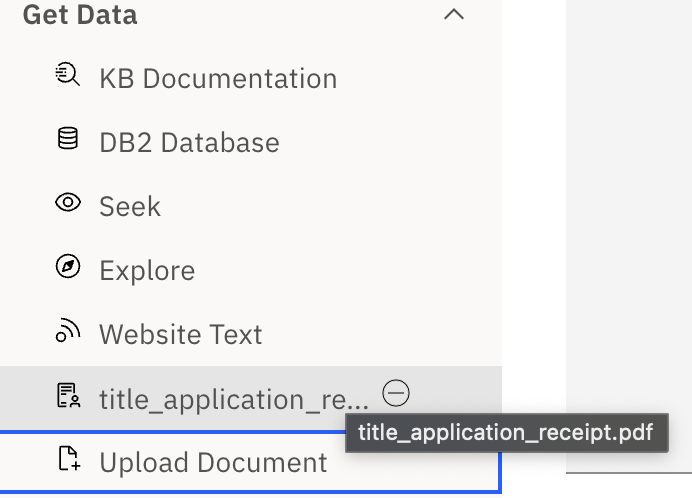
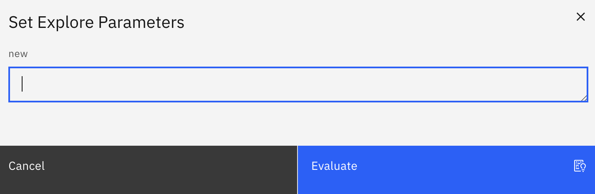

# NeuralSeek Template Lanauge (NTL)

## What is it?

NeuralSeek's explore feature is powered by NeuralSeek Template Language which lets user extract data from different sources, and then extract and format data that then can be used to drive subsequent LLM processing without the need to code in programming language.

## How to use it?

### Getting Data

#### KB Documentation

KB stands for KnowledgeBase, and the query is used to retrieve snippets of document that the underlying knowledge base would return.

Basic syntax looks like the following:


`{{ kb|query:"your KB query" | snippet: "" | scoreRange: "" | filter: "" }}`


- query: The actual query
- snippet: snippet size (tokens to be returned). For example, 100 will return snippets of around 100 characters, while 1000 will return ~1000-character snippets.
- score range: minimum score to be returned the value is between 0.0 to 1.0, where higher score will only return snippets with higher score.
- filter: If the filter is defined in the knowledge base (e.g. DQL pushdown), you can define the filter value to be used.

Any null string value such as ‘’ or “” will be considered as null.

#### DB2 Database


`{{ db2|query:"your db2 query" | DATABASE: "" | HOSTNAME: "" | UID: "" | PWD: "" | PORT: "" | SECURE: "true" | sentences: "true"}}`


Uses data returned from SQL statement (db query) on IBM DB2 database.

#### Seek


`{{ seek|query:"your Seek query" | stump: "" | filter: "" | language: "" | seekLLM: "" }}`


Seek lets users perform `seek` to NeuralSeek, and provide it as a data. The following parameters can be provided:

- query: The query itself
- stump: optional stump speech that overrides existing stump speech.
- filter: filter to be provided when running seek. Identical to how filter is used in KB documentation.
- language: seek target language to be used.
- seekLLM: type of LLM for the seek to explicitly use, if your NeuralSeek uses BYOLLM (bring your own LLM) plan.

#### Explore


`{{ explore|template: "" }}`


Lets you invoke explore template to derive results. Provide the template name. For example, if you have a template called `neuralseek_updates`, that looks like this:


```
Based on the changelogs found here:
{{ web|url:"https://documentation.neuralseek.com/changelog/" }}
list the items for the latest month.
{{ LLM }}
```



Simply using the `{{ explore|template: "neuralseek_updates" }}` will produce the sample result.


**Providing the parameters**

In case you have defined a parameter in your explore:


```
Based on the changelogs found here:
{{ web|url:"<< name:'url' >>" }}
list the items for the latest month.
{{ LLM }}
```


You can simply enter the name and value of the parameter followed by the template to specify values:


`{{ explore|template: "neuralseek_updates"|url: "https://documentation.neuralseek.com/changelog/" }}` 


Notice that in this way your invocation to explore will be much more flexible, as you can dynamically provide the parameters when calling other explore.

#### Website Text


`{{ web|url:"[https://yourpage.com](https://yourpage.com/)" }}`


Uses URL to read the HTML documents. Currently do not support any authentication mechanism.  For example,


```
{{ web|url:"https://en.wikipedia.org/wiki/Roman" }}=>{{ keywords|nouns:false }}
```


Will extract proper nouns from the wikipedia page related to Roman. The result will be:

```
Wikipedia, encyclopedia, Roman, Romans, român, Wiktionary, Rome, Italy Ancient Rome, BC, Rome Epistle, Testament, Christian Bible Roman, Music Romans, Sound Horizon, EP, Teen, Boy, Morning Musume Film, Film Roman, Indian Malayalam, Doctor, People Roman, Romans Ῥωμαῖοι, Rhomaioi, Greeks, Middle Ages, Ottoman, Rûm, Muslim, Bulgaria Roman Municipality Roman, Eure, France Roman, Romania Roman County, Sakha Republic, Russia Roman River, Essex, England Roman Valley, Nova Scotia, Canada Romans Romans, Ain, France Romans, Deux, Sèvres, France Romans dIsonzo, Italy Romans, sur-Isère, France Religion Roman Catholic, Roman Catholic, Nancy Grace Roman Space Telescope, Roman Space Telescope, NASA, ROMAN, Search, Wikipedia., Romans History, Greco, Romany, Gypsies, Roma, Disambiguation, Wikidata
```

#### Upload Document

Uploading the document works in two steps. When you click the `Upload Document` button, you are presented with a file selector to select a local documentation to upload. The supported files are .docx, .doc, .pdf, .txt, .csv, .json, and xlsx.

After the document is successfully loaded, it is available in the NTL templates:



Clicking the upload document can then be used using the following syntax:


`{{ doc|name:title_application_receipt.pdf }}`


Currently the document does not support OCR, and thus only textual data will be able to be extracted and used.

### Modifying Data

#### Set Variable


`{{ variable|name:"myVariable" }}`


Creates a variable that can be used multiple times inside the NTL expression. For example, 


```
12=>{{ variable|name:"age" }}
What is your age? My age is << name: age >>
```


This will first set the variable ‘age’ with the value 12, and then use it to output the person’s age:

```
What is your age? My age is 12
```


⚠️ When the variable is NOT found but used in << >> notation, the variable is considered as user input, and explore will ask its value prior to the evaluation. For example, if you have << name: new >> and there is not such thing as `{{ variable|name: "new" }}` in the expression, explore will ask for it:




#### Remove PII


`{{ PII }}`


When used, will hide all the detected PII information. For example,


```
howardyoo@mail.com Howard Yoo Dog Cat Person
{{ PII  }}
```


Will output:

```
****** ****** Dog Cat Person
```

#### Summarize

Summarization summarizes given text into shorter size, while maintaining the main content.


```
I have 20 cats and 40 dogs - it's a lot of furry friends to take care of! My name is Jane and I run an animal rescue shelter out of my home. It all started a few years ago when I took in a litter of abandoned kittens. I fell in love with them and decided to make it my mission to give unwanted animals a forever home. 
{{ summarize|length:100 }}
```


will yield:

```
I have 20 cats and 40 dogs - it's a lot of furry friends to take care of!
```

#### Remove Stopwords

Removes the [stop words](https://en.wikipedia.org/wiki/Stop_word) 


```
I have 20 cats and 40 dogs
{{ stopwords }}
```


Will yield

```
20 cats 40 dogs
```

Notice `I have` is deemed as insignificant and thus have been removed.

Another example:


```
I have 20 cats and 40 dogs, isn't this amazing?
{{ stopwords }}
```


Will yield

```
20 cats 40 dogs, amazing?
```

#### Extract Keywords

Extracts important keywords from the text.


```
I have 20 cats and 40 dogs
{{ keywords|nouns:true }}
```


Will yield:

```
20 cats, 40 dogs
```

Notice how `nouns:true` is used to detect cats and dogs. If `nouns:false`, only the `proper nouns` will be extracted. What is this proper nouns? Proper noun is a name used for an individual person, place, or organization, spelled with initial capital letters, e.g., Larry, Mexico, and Boston Red Sox.

So, for example, 


```
Howard has 20 cats and 40 dogs
{{ keywords|nouns:false }}
```


Will yield:

```
Howard
```

As `Howard` is a person’s name (and thus falls into the proper noun). If the `nouns: true` is used,

```
Howard, 20 cats, 40 dogs
```

Is returned.

#### Force Numeric

`I have 20 cats and 40 dogs` contains numeric values. Force Numeric simply removes all non-numerics and concatenates all numerics into a single value. So, running this:


```
I have 20 cats and 40 dogs
{{ forceNumeric }}
```


Will yield:

`2040` since 20 concatenated by 40 is 2040.

##### Follow-up question

Is there a way to only extract 20 or 40? One way is to use `split` if you know the start and end portion. For example,


```
I have 20 cats and 40 dogs
{{ split | start: "have" | end: "and" | removeHeaders: false }}=>{{ forceNumeric }}
```


Notice how split is splitting the sentence to this:

```
have 20 cats
```

Which is then processed with `{{ forceNumeric }}` and thus yields:

```
20
```

Then, how about the latter part? (40 dogs)


```
I have 20 cats and 40 dogs
{{ split | start: "and" | end: "" | removeHeaders: false }}=>{{ forceNumeric }}
```


Notice how you can use empty string for “end” and it will split the sentence into:

```
and 40 dogs
```

Which can then be processed with `{{ forceNumeric }}` and thus yields:

```
40
```

#### Table Prep

`{{ tablePrep | query:"" }}`

tablePrep prepares tabular data to be better understood and processed by LLM. For example, if we have a CSV
typed data, table prep will convert it into 


```
col1,col2,col3
data1,data2,data3
data11,data22,data33
{{ tablePrep }}
```


The result will be:

```
{
  "col1": [
    "data1",
    "data11"
  ],
  "col2": [
    "data2",
    "data22"
  ],
  "col3": [
    "data3",
    "data33"
  ]
}
```

There is an optional `query` parameter that you can use to narrow down the data for better performance. For example:

```
col1,col2,col3
data1,data2,data3
data11,data22,data33
{{ tablePrep|query: "values for col1" }}
```


is going to retrieve all the values for col1 which will then be:
```
{
  "col1": [
    "data1",
    "data11"
  ]
}
```

#### Split

Simple split operation to split (or cut) part of text using `start` and `end` string.


```
I have 20 cats and 40 dogs.
{{ split | start: "20" | end: "40" | removeHeaders: false }}
```


will yield:

```
20 cats and
```

the start and end keyword is case sensitive, so 


```
I have 20 cats and 40 dogs.
{{ split | start: "CAT" | end: "dogs" | removeHeaders: false }}
```


Will yield

```
I have 20 cats and 40
```

Notice that the start word is `included` in the result, while end word is `excluded`.

Using `removeHeaders` will strip frequently repeating lines out of given input text. For example:


```
My animals:
I have 20 cats and 40 dogs.

My animals:
I have 47 hamsters and 22 pet snakes.

My animals:
I pet all my animals every day.

{{ split | removeHeaders: true }}
```


Would output:

```
I have 20 cats and 40 dogs.

I have 47 hamsters and 22 pet snakes.

I pet all my animals every day.
```

This is particularly useful when dealing with web content as input.

#### Regular Expression
`{{ regex  | match: "" | replace: "" | group: "" }}`
Performs regular expression on given data. Regular expression can be a powerful feature to extract or replace certain data.

For example, if you have a text that you need to replace with something else, you can use the following expression:


```
my name is howardyoo
{{ regex  | match: "yoo" | replace: "yu" }}
```


Which yields:

```
my name is howardyu
```

Regex also supports extraction. For example, if you want to extract the email address in a text message, you can do so:


```
my name is howardyoo@email.com
{{ regex  | match: "[a-zA-Z0-9._%+-]+@[a-zA-Z0-9.-]+\\.[a-zA-Z]{2,}" | group: "0" }}
```


This will extract the email address (group 0). The response is:

```
howardyoo@email.com
```

Regex also supports groups, so in case you want to get an last digits of the phone number, you can do so like the following example:


```
my phone number is 213-292-3322
{{ regex  | match: "([0-9]+)-([0-9]+)-([0-9]+)" | group: "3" }}
```


which will result in:
```
3322
```

### Generating Data

#### Send to LLM

`{{ LLM }}`

send to LLM may perhaps be the most frequently used syntax in NTL. There’s an additional option, which is called `prompt` , that you can prepend prompts to it. For example,


```
Write a short poem about NeuralSeek
Here is the definition of NeuralSeek:
{{ seek|query:"What is NeuralSeek" }}=>{{ summarize|length:100 }}
{{ LLM }}
```


This will write a short poem about NeuralSeek, but based on the summary that it gathers from the seek operation that provides information on NeuralSeek. If this was given to LLM without any context of what NeuralSeek was, the LLM would have creatively guessed what NeuralSeek could have been (e.g. Cyberpunk Musician).

In the LLM syntax, you can add additional prompts such as:


```
Write a short poem about NeuralSeek
Here is the definition of NeuralSeek:
{{ seek|query:"What is NeuralSeek" }}=>{{ summarize|length:100 }}
{{ LLM|prompt: "write in Spanish" }}
```


To generate the final output in Spanish:

```
En el vasto mar de la información,
NeuralSeek es navegación,
Con su LLM de gran sofisticación,
Da respuestas con precisión.

De la base de conocimiento bebe,
Y al usuario lo que busca le ofrece,
En el contexto siempre se mueve,
Con inteligencia que el saber teje.

No hay duda intrincada o perdida,
Que NeuralSeek no pueda esclarecer,
Con su ayuda, la búsqueda es vencida,
Y el conocimiento se puede entender.

Como faro en la noche del dato,
Ilumina el camino a seguir,
NeuralSeek, el asistente innato,
Para en el saber siempre fluir.
```

#### Table Understanding


`{{ TableUnderstanding|query:"What year had the highest revenue?" }}`


This works with uploaded Excel or CSV files. Use natural language to query and extract a value from the tabular structure it contains.

#### Mathematical Equation


`{{ math|equation:"1 + 1" }}`


Performs mathematical equation on input strings.

It features a flexible expression parser with support for symbolic computation, comes with a large set of built-in functions and constants, and works with different data types like numbers, big numbers, complex numbers, fractions, units, and matrices. Powerful and easy to use.

### Sending Data

#### POST


`{{ post | url: "" | headers: "" | body: ""}}`


Performs HTTP POST operation, with the given data.

#### Email


`{{ email|host:"" | port: "" | user: "" | pass: "" | from: "" | to: "" | subject: "" | message: "" }}`


Sends the content as email message, with the given data. Useful in templates. host and port is the host and port of SMTP server.
