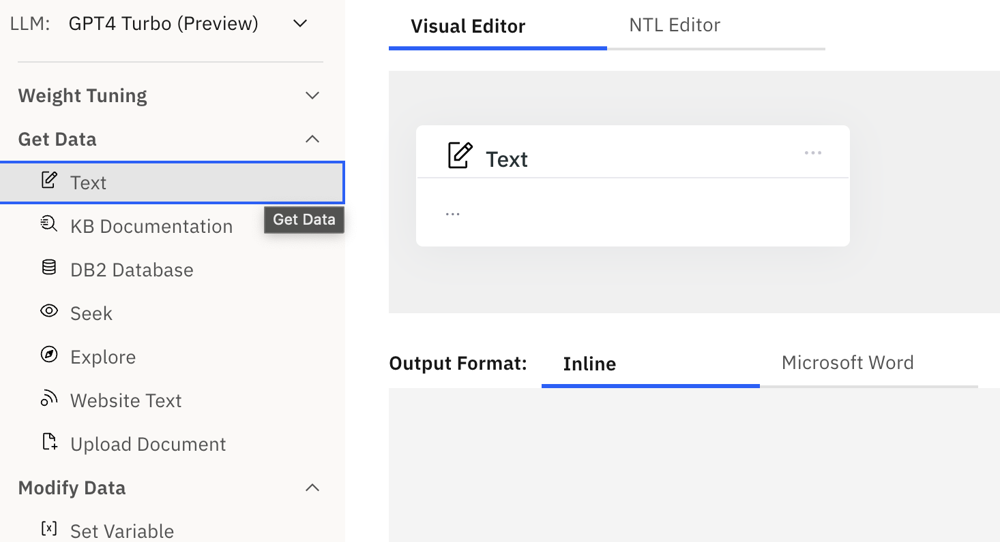
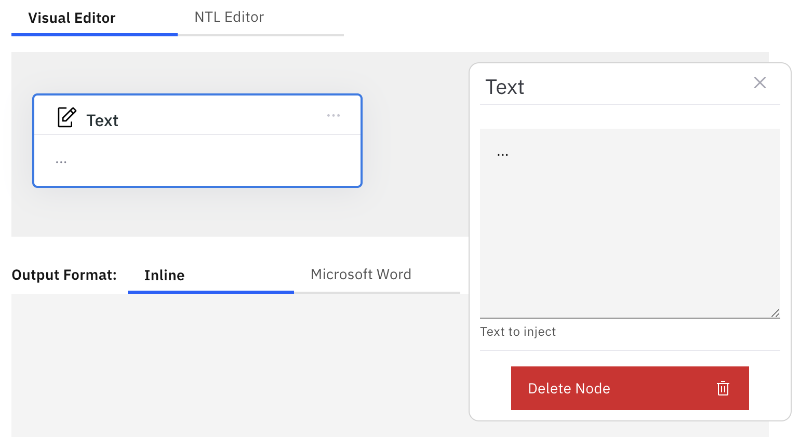
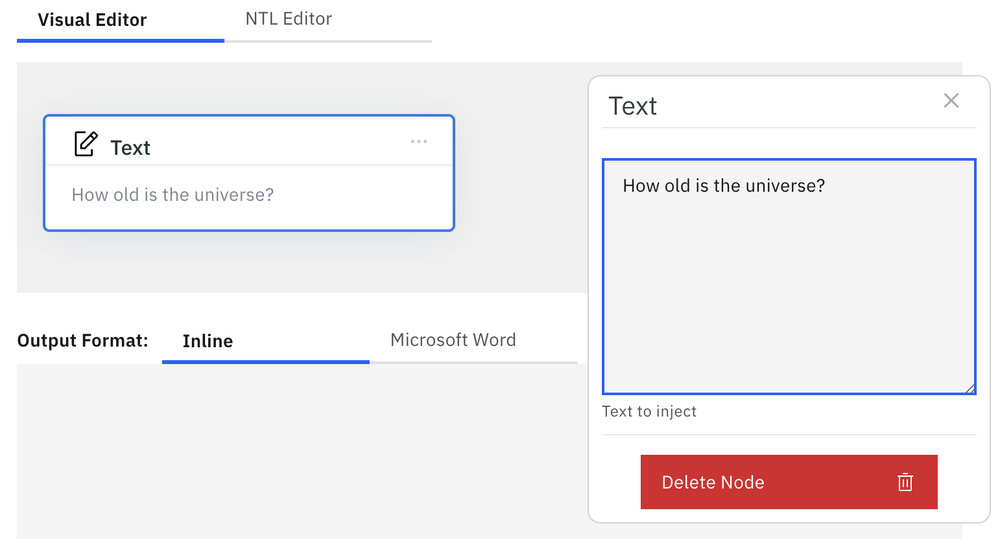
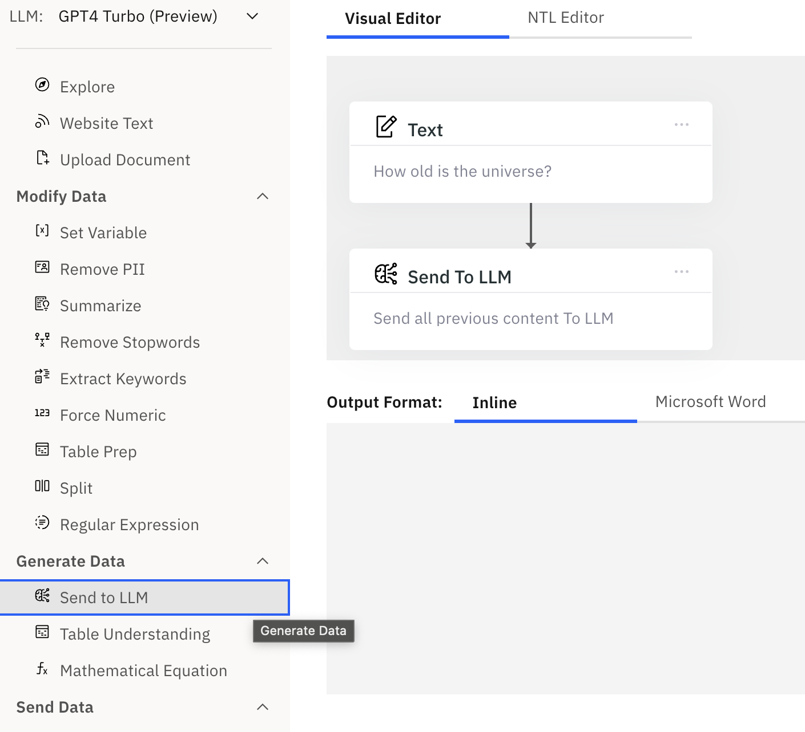
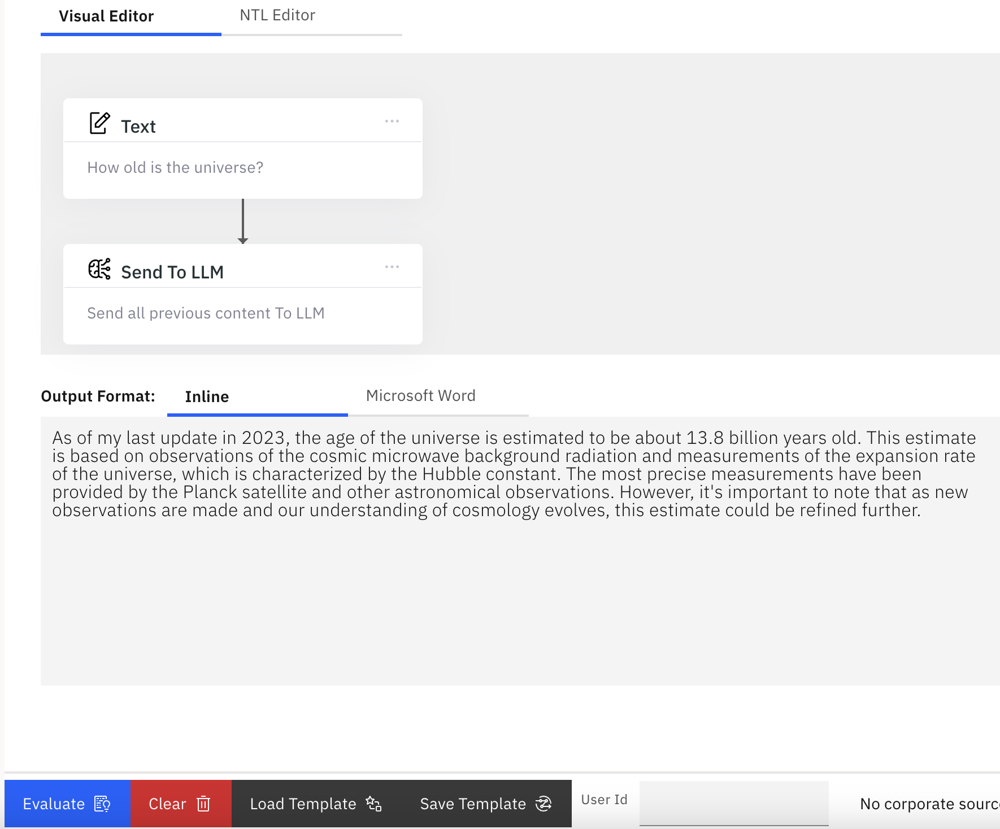
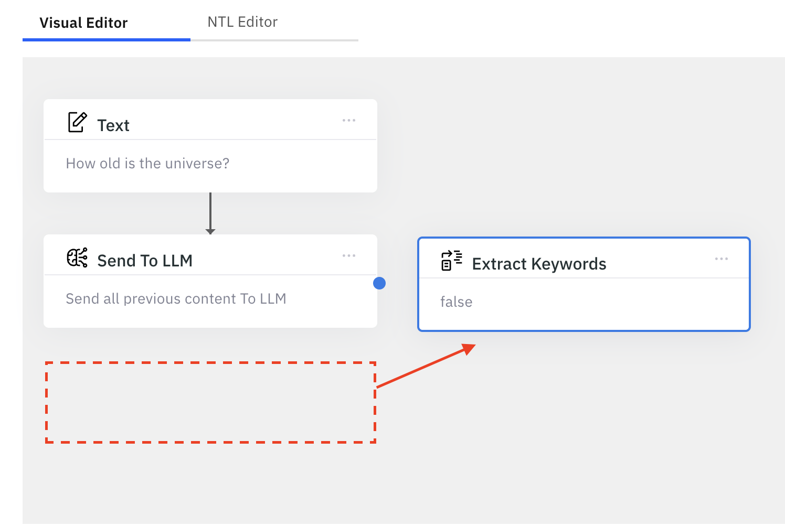
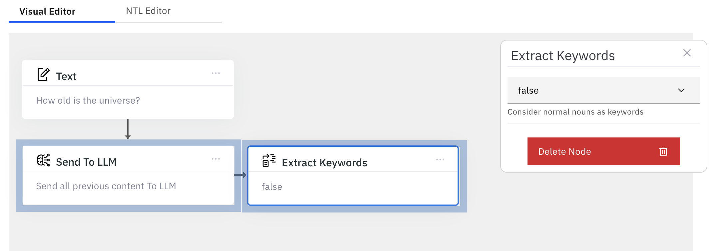
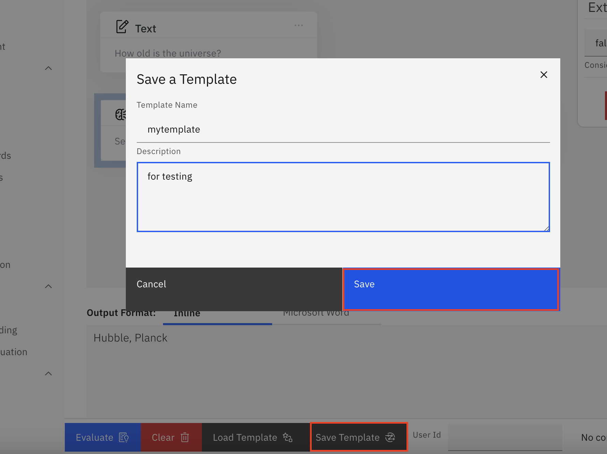
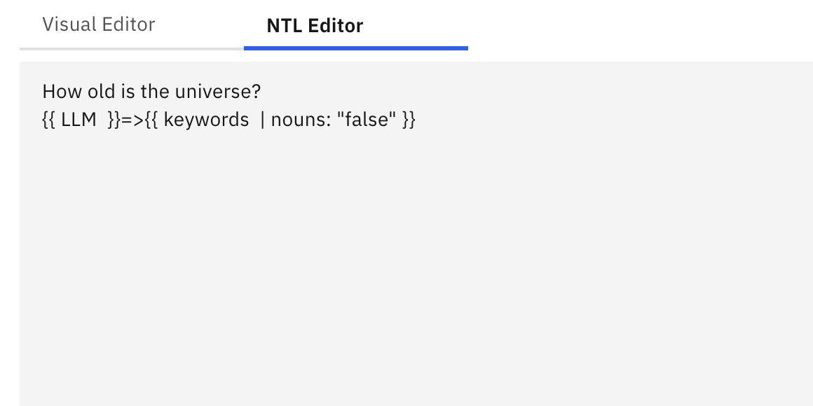

# Explore Visual Editor

## What is it?

Visual Editor is the editor of choice when you are using NeuralSeek's explore feature. Even though typing the full NTL expression is not overly complex, it can get quickly tedious and time consuming. Visual editor provides a great way for any user to easily and quickly create the expression using simple drag-n-drop with minimum typing.

## How do you use it?

### Switching to visual editor
In Explore, simply click the `Visual Editor` tab on the top of the page to enable the visual editor.

### Click to insert
All the elements on the left panel can be created to the editor by clicking them.

Element 'Text' is now visible in the editor.

### Click to edit
Click the Text box, and the selected box will be highlighted in blue color, and secondary properties dialog will appear on the right side.

Depending on the type of the element, there will be several inputs that you can then specify to it. For example, the text element can have string data.

### Deleting the node
You also have option to delete the node, by clicking the red `Delete Node` button at the bottom.

### Stacking elements
Clicking elements by default will connect the elements vertically. We call this `Stacking`.

Stacked elements flow from top to bottom, meaning the output produced by the top element will become the input to the bottom element.

### Evaluating
Clicking the evaluate button will run the expression, and generate answers.

### Chaining elements
Aside from stacking, you can also connect elements horizontally. We call this `Chaining`.

In this example, click the element `Extract Keywords` to get stacked under `Send To LLM`.

And then, click the element, and drag on to the right side of the element that you want to chain. You will see a blue dot indicating that this would be the element that it will be chaining to.

Release the click, and the elements are now chained together.

Chaining is useful when you want an element's flow to be directed only from its output. In this example, the output of the LLM will `only` going to be provided as input to the extract keywords element, `chained` together.

### Saving as user template
You may frequently be using the same expression over and over again, and visually editing them everytime is just not productive. In that case, you can save the template to be reused again.

Click the `Save Template` button. Enter its name and description.

Click `Save` to save it into the user template.

### Loading the template
Your saved template can be loaded or used as necessary. Click `Load Template`, select `User Templates`, and click the checkbox to the template that you want to load. Click `Load Template` to load the saved template into the editor.

### Deleting the template
You can also check and click `Delete Template` button to delete the checked template.

### Switching between Visual Editor and NTL editor
You can switch between visual editor and NTL editor at any time you want. Any changes that you make on either side will be applied to other automatically.

