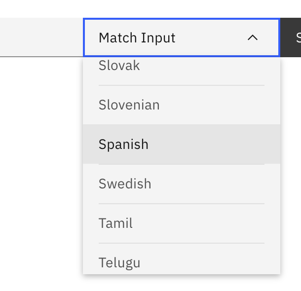

# Multi Language Support

## What is it?
NeuralSeek has several different language options available for understanding questions and delivering answers. These include English, Spanish, Portuguese, French, German, Italian, Arabic, Korean, Chinese, Czech, Dutch, Indonesian, and Japanese. These can be adjusted on the “Configure” section of the NeuralSeek console, or on the “Seek” endpoint.

### Supported Languages
|Language|Lang code|
|---|---|
|English|en|
|Match Input|xx|
|Arabic|ar|
|Basque|eu|
|Bengali|bn|
|Bosnian|bs|
|Bulgarian|bg|
|Catalan|ca|
|Chinese (Simplified)|zh-cn|
|Chinese (Traditional)|zh-tw|
|Croatian|hr|
|Czech|cs|
|Danish|da|
|Dutch|nl|
|Estonian|et|
|Finnish|fi|
|French|fr|
|German|de|
|Greek|el|
|Gujarati|gu|
|Hebrew|he|
|Hindi|hi|
|Hungarian|hu|
|Irish|ga|
|Indonesian|id|
|Italian|it|
|Japanese|ja|
|Kannada|kn|
|Korean|ko|
|Latvian|lv|
|Lithuanian|lt|
|Malay|ms|
|Malayalam|ml|
|Maltese|mt|
|Marathi|mr|
|Montenegrin|cnr|
|Nepali|ne|
|Norwegian Bokmål|nb|
|Polish|pl|
|Portuguese|pt-br|
|Punjabi|pa|
|Romanian|ro|
|Russian|ru|
|Serbian|sr|
|Sinhala|si|
|Slovak|sk|
|Slovenian|sl|
|Spanish|es|
|Swedish|sv|
|Tamil|ta|
|Telugu|te|
|Thai|th|
|Turkish|tr|
|Ukrainian|uk|
|Urdu|ur|
|Vietnamese|vi|
|Welsh|cy|

Match Input Feature: NeuralSeek can understand and support conversations that are initiated in languages other than the ones listed through the Match Input Feature. On the “Seek” endpoint, click the dropdown for language navigation and click “Match Input.

## Why is it important?
Being able to automatically translate answers to an appropriate language without relying on virtual agent is important, as this greatly simplifies running it. Instead of having to train your virtual agents to understand various different languages, your question can be automatically converted into the response in the language of your choice.

## How does it work?
NeuralSeek will try to determine if the user is asking question in certain language (e.g. Spanish), and will try to conver the resopnses into the language that the user asked without any additional set ups.

### Specifying a langauage
If you would like to specify certain target language that you want NeuralSeek to generate answers into, you can do so by specifying a language code (e.g. es) in the request when you are invoking `Seek`.

The same can be achieved when you are invoking `Seek` using REST API. You can specify the langauge under the `options > language`.
