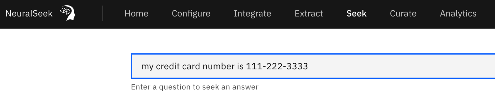
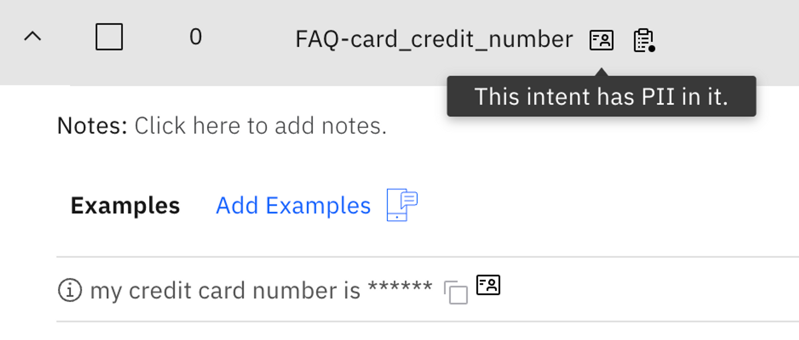
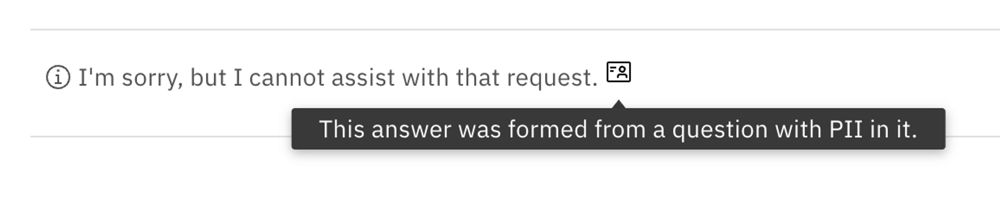
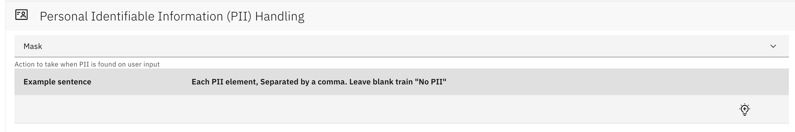
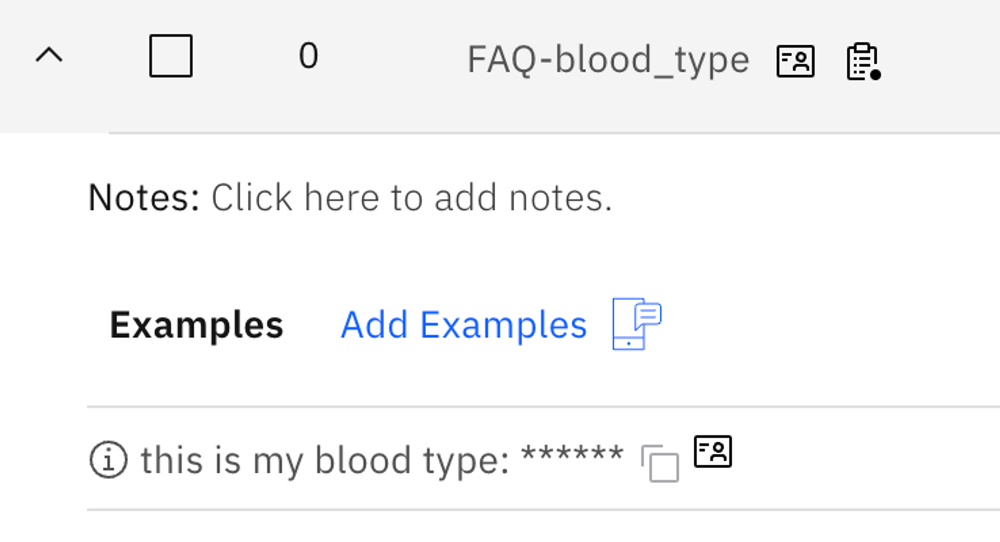
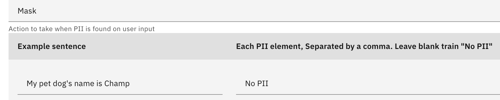
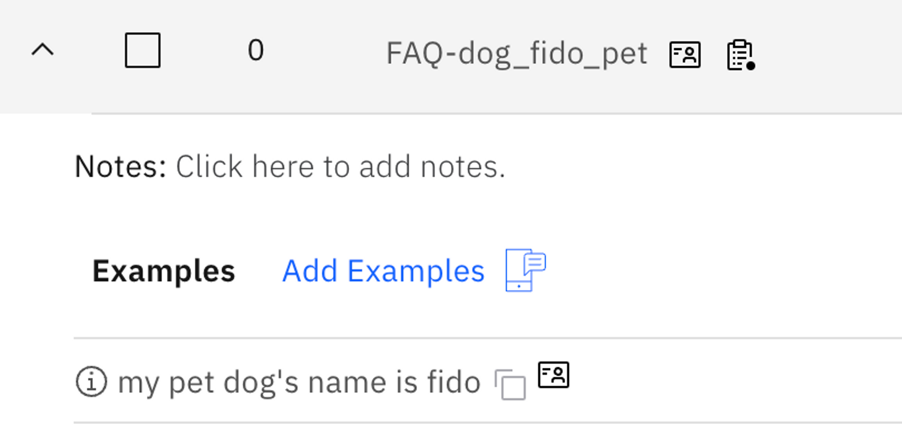

# PII Detection

## What is it?
NeuralSeek features an advanced Personal Identifiable Information (PII) detection routine that automatically identifies any PII within user inputs. It allows users to flag, mask, hide, or delete the detected PII.

## Why is it important?
Users can maintain a secure environment while providing accurate responses to user queries, ensuring compliance with data privacy regulations and protecting sensitive information.

## How does it work?
Common and well known PII detection is enabled by default in NeuralSeek. When you enter a PII information, for example, when you enter a credit card number in Seek:



In NeuralSeek, the question above will be logged and flagged as containing PII information and warns user about a potential risk.



The credit card number is also masked and removed, so that the data is protected from from being viewed. The answers to these questions also indicate that they were generated from a question with PII in it, so that you can easily identify them.



### Defining a specific PII
However, this is what NeuralSeek does against common PII patterns, and there may be a specific PII that you would like to hide for your specific business needs. If you want to help NeuralSeek better detect and process PII for that, you can configure it under `Configure > Personal Identifiable Information (PII)` Handling in the top menu:



How it works is based on example sentence, and does not have to be an exact pattern or rules. For example, setting the example sentence as:

```
My name is Howard Yoo and my blood type is O, and I live in Chicago.
```

For each PII element in that sentence, you can define the PII elements in that sentence delimited by comma as such:

```
Howard Yoo, 0
```

So, next time, when somebody enters a PII matching the example as such:

```
This is my blood type: A
```

NeuralSeek now detects that and masks the blood type that the user provided from being exposed:



### Ignoring certain PII
You can also make NeuralSeek ignore certain PII by entering “No PII” to the element. For example, by setting the element as “No PII” with a given example sentence, NeuralSeek will not filter out the question even though it would contain an PII element:



Therefore, when asked about a similar question, notice how dog’s name is now visible as not a PII information:



The base reason to use this is that sometimes, NeuralSeek would mistake certain question to be containing PII, even though the sentence may clearly not contain any such data. In that case, setting what not to consider as PII would be very helpful.