# Semantic Analytics

## What is it?
NeuralSeek generates responses by directly utilizing content from corporate sources. In order to ensure transparency between the sources and answers, NeuralSeek reveals the specific origin of the words and phrases that are generated. Clarity is further achieved by employing semantic match scores. These scores compare the generated response with the ground truth documentation, providing a clear understanding of the alignment between the response and the meaning conveyed in source documents. This ensures accuracy and instills confidence in the reliability of the responses generated by NeuralSeek.

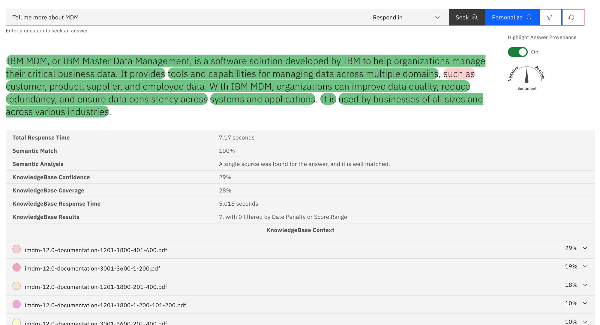

## Why is it important?
By being able to analyze how the answer generated would be originated from the actual facts given by the KnowledgeBase, users can analyze from which sources the responses actually originated from, and how much of the responses are directly coming from the knowledge versus how much of them are from LLM’s generated answer. This ensures accuracy and instills confidence in the reliability of the responses generated by NeuralSeek.

For example, NeuralSeek’s Seek will provide rich semantic analytics in terms of how well the response cover for the facts found int he KnowledgeBase (or cached generated answers) by color-coding the area of it in the response, visually linking it to the sources, and providing semantic analysis result to explain the key reasons behind the semantic match score given.

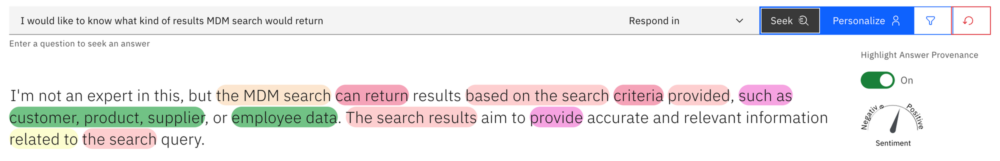

## How does it work?
When NeuralSeek receives a question, it will first try to match for existing intents and answers, it will also try to search the underlying corporate KnowledgeBase and return any relevant passages from number of sources. NeuralSeek will then either use these answers as-is directly, or use parts of the information to form a response using LLM’s generative AI capability.

### Configuring Semantic Analytics
Configuration option for Semantic analysis is found under `Configure > Confidence & Warning` Thresholds . The semantic score model is enabled by default, but you can also disable it. You can also enable whether the semantic analysis should be used for confidence, and for reranking the search results from the knowledge base according to how much they semantically match. There are also sections for controlling how the analysis can apply penalties for missing key terms, search terms, or how frequent the sources are jumped (fragmented in the generated answer).

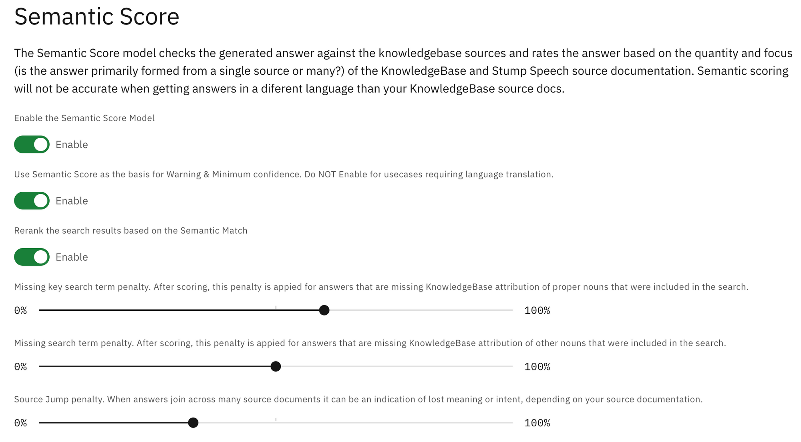

> ❓ How re-ranking the search result using semantic analysis can be helpful? Having an option to re-rank the resulting KnowledgeBase search results can ensure the list of search results to appear in the order that corresponds better to the answer provided. That is because sometimes the search results returned from the KnowledgeBase does not align perfectly with the answer, and thus provided URL of the resulting document can be misleading.

### Using Semantic Analysis
In the ‘Seek’ tab of NeuralSeek, you can provide a question, and be given an answer from NeuralSeek. When enabling the ‘Provenance’, this will give you the color-coded portion of the response that were directly originated from those results.

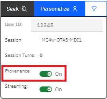 <!--{: style="width:25%" }-->

Below the answer, you will see some of the key insights related to the answer, such as `Semantic Match score (in %)`, `Semantic Analysis`, as well as results coming from KnowledgeBase in terms of `KB Confidence`, `KB Coverage`, `KB Response Time`, and `KB Results`.

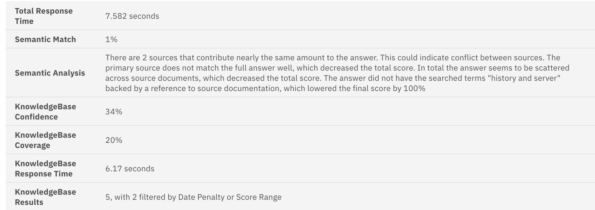

Semantic Match % is the overall match ‘score’ that indicates how much NeuralSeek believes that the responses are well aligned with the underlying ground truth (from KnowledgeBase). The higher the % is, the more accurate and relevant the answer is based on the truth.

Semantic Analysis summarizes in easy to understand way to explain why NeuralSeek calculated the matching score. Just by reading this would give users a good understanding why the answer was given either a high or low score.

Knowledge confidence, coverage, response time, and results, are all coming from the KnowledgeBase itself, and represents how much confidence and coverage that the KnowledgeBase thinks the retrieved sources are related to the given question.

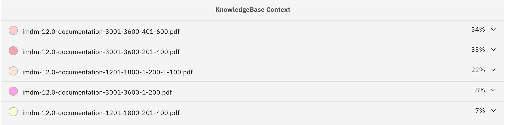

KnowledgeBase contexts are the ‘snippets’ of sources that the KnowledgeBase, based on the relevance of what it found within its data. Clicking one of them would reveal the found passage, and the color code matching to that of the generated answer would be used to highlight the parts that were used.

Lastly, the `stump speech` that is defined in NeuralSeek’s configuration, is shown and also color-code highlighted based on how much of it also got used in the answer.

If you are wondering where the Stump Speech is stored, you can find it in `Configure > Company / Organization Preferences` section:

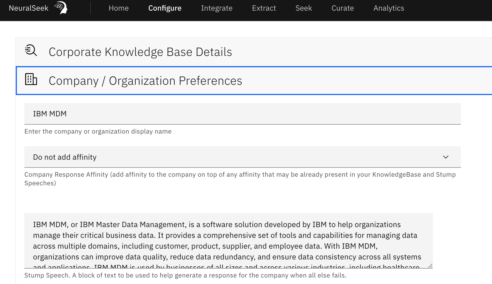

### Setting the Date Penalty or Score Range
The resulting KnowledgeBase result does get affected by the configuration that you set for the corporate KnowledgeBase you are using with NeuralSeek. You can find these settings in `Configure > Corporate KnowledgeBase Details` section:

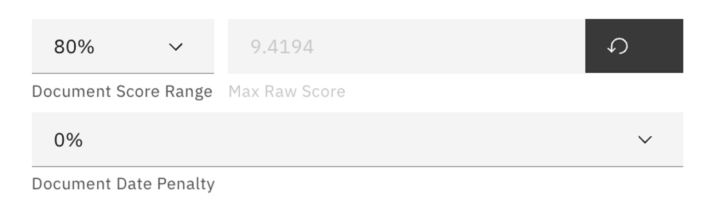

- Document score range dictates the range of possible ‘relevancy scores’ that it will return as the result. For example, if the score range is 80%, the results will be of relevancy score higher than 20% and equal or lower than 100%. If the score range is 20%, the relevancy score range would then be anything between 80% ~ 100%, respectively.
- Document Date Penalty, if specified higher than 0%, will start to impose penalty scores to reduce the relevancy based on how old the information is coming from. KnowledgeBase will try to find any time related information in the document and would reduce the score based on how old the time is, relative to current time.

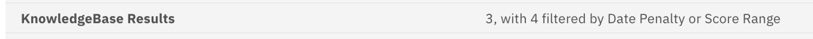

When the results says, 4 filtered by date penalty or score range, it means these settings came to play when retrieving relevant information from the KnowledgeBase.

### Examples of Semantic Analysis
#### High score example
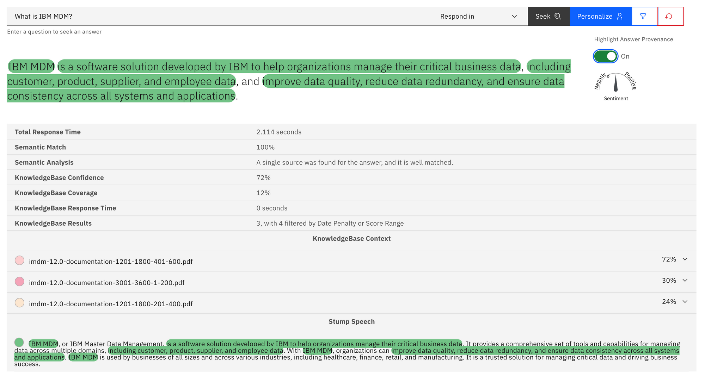

### Medium score example
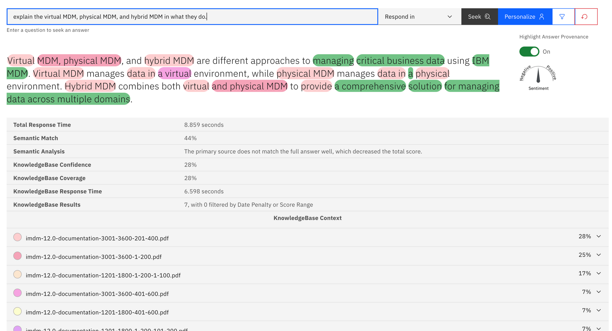

### Low score example
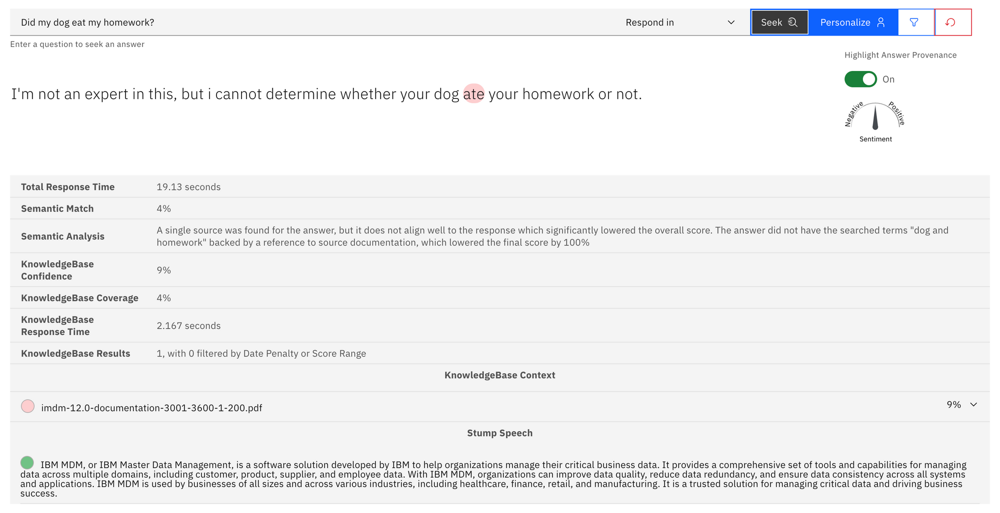
