# Training Virtual Agents

## What is it?
NeuralSeek will automatically generate IBM Watson Assistant “Actions” or “Dialogs,” based on user questions that are asked. Generally, IBM Watson Assistant needs five (5) or more user question examples to train on for a high confidence match to a user query. When user questions are cataloged by the system, NeuralSeek automatically tries to generate similar worded questions to meet the minimum of five (5) user examples. Similar Question generation may take up to one (1) minute to show inside the Curate tab after a new user question is logged.

## Why is it important?
Users who develop and maintain Watson Assistant have to work with its Actions and Dialogs, and can quickly get overwhelmed by its vast numbers. Coming up with multiple number of questions for each intent is also very time consuming, but it also quickly becomes burdensome when you have to continuously monitor and update them by yourself.

## How does it work?
NeuralSeek provides ways to generate the candiate questions and answers based on the contents inside the KnowledgeBase, and let users download the whole thing or portions of it, so that it could be created either as 1) Watson Assistant Actions, or 2) Watson Assistant Dialogs.

### Generating Questions and Answers
After you have configured NeuralSeek, in its `home`, you will see an option to auto-generate questions.

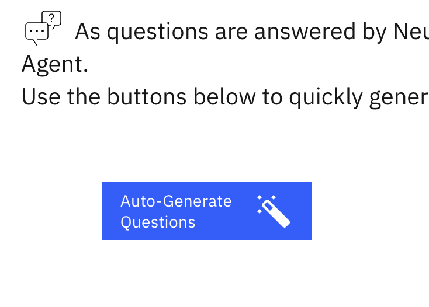

Clicking will let NeuralSeek scan through your KnowledgeBase, and start generating potential questions that would be most commonly used.

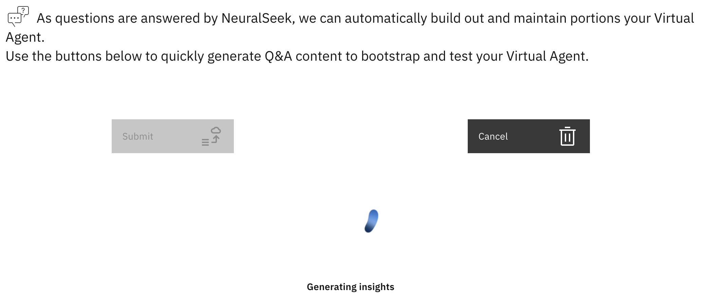

The resulting list of questions appear at the bottom. If you do not like the list of questions, you can re-generate them again, or edit them on the spot.

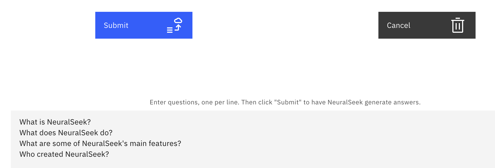

When you feel like you can generate the Answers for those questions, you can click Submit button and those questions will be available on the `curate` tab of the top menu. Usually the most recently entered questions and answers appear at the top:

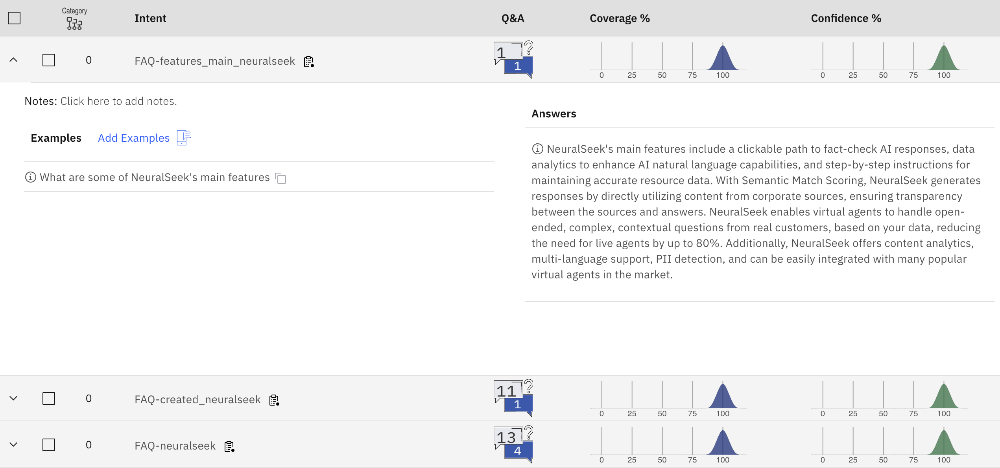

### Testing Questions
During the curation process, usually the user would need to use `Seek` tab to submit questions to see how well the answer is generated. However, this process can be tedious if you have a certain set of questions that you want to ask in bulk and derive the results. In that case, you can use `Upload Test Questions` to upload multiple questions and generate their answers easily.

1. Go to `Home` of NeuralSeek, and click `Upload Test Questions`.
2. In the instructions, you will see a link of `template` file that you can download from. It's a template file in CSV format. click it to download.
3. Use the file to enter the list of questions. For example,
```csv
ID,Question
1,"What are the main features of NeuralSeek?"
2,"What are the knowledgebases supported by NeuralSeek?"
3,"I want to integration NeuralSeek with Watson Assistant. What do I need to do?"
4,"Where can I see the demo?"
```
4. Click the upload button to upload the file.
5. Click `Submit` button.
6. NeuralSeek will run through the questions and let you know how many are being processed. When it is finsihed it 
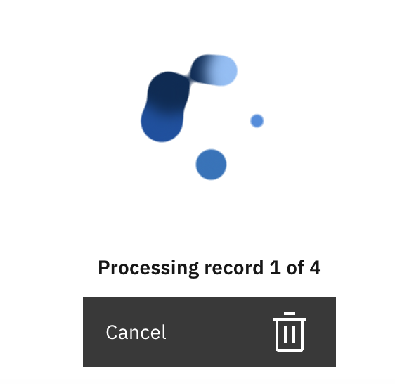
7. When finished, you can either Download the report, Export All Q&A, or Delete the generated report.

 - Download the report: it will give you a CSV file that has the following columns:
 `ID,question,score,semanticScore,kbCoverage,totalCount,url,document,answer,categoryId,category,intent,pii,sentiment` which will give you the answer and score of how well it got generated.
 - Export All Q&A: it will export all the Q&A currently stored in NeuralSeek, in JSON format suitable to be imported as Watson Assistant Actions.
 - Delete Report: it will delete the generated report, and will not be available anymore.

### Uploading Curated Q&A
This feature is very similar to `Upload Test Questions`, but uses the CSV format that has `ID,Question,Answer`. User can create question and answer pairs to submit it, which will then be populated as `edited answers` in NeuralSeek. This feature is useful when you need to edit and upload answers in bulk fashion. An example format of the CSV is as follows:
```csv
ID,Question,Answer
1,Tell me about NeralSeek,"NeuralSeek is an AI-powered platform that generates natural-language answers to complex, open-ended, and contextual questions from real customers."
```

### Importing Q&A into Watson Assistant
Depending on how your NeuralSeek is setup, it can either product questions and answers into `Action` type or `Dialog` type. That depends on whether your Watson Assistant is enabled with dialog or not.

#### Importing into Watson Assistant as Actions
👉 As for importing Q&A into Watson Assistant, you can do it on both Watson Assistant `Classic` mode or new `Dialog` mode.
1. Go to your Watson Assistant, and to go to `Actions`. Click the gear icon on top right to go into the settings.
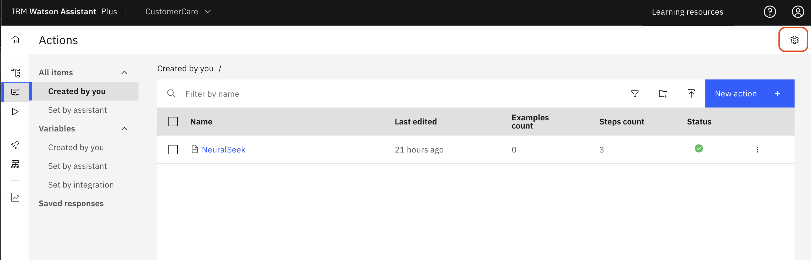
2. In the global settings, move to the right most tab which is `Upload/Download`, and click `Download` button to download the action's JSON file.
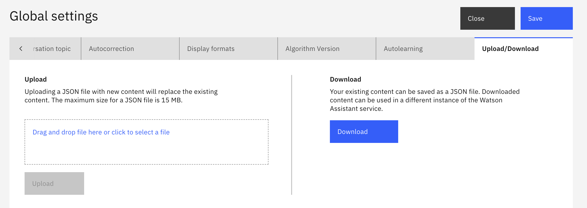
3. A JSON file should be saved.
4. Go to NeuralSeek, click `Curate` tab.
5. Click `Import Base Watson Assistant Actions`.
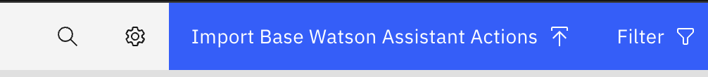
6. Upload the downloaded JSON file.
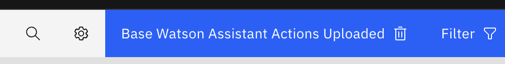
7. Now, select one or more intents which you want to import into Watson Assistant. You will notice a new button is display which is `Export to Watson Assistant Actions`.
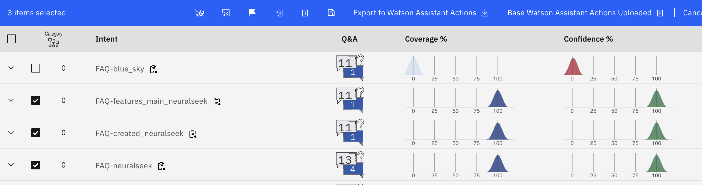
8. It will download a JSON file called `actions.json` which will contain the selected intents that you want to convert it into Watson Assistant Actions.
9. Go to Watson Assistant. At the same page where you just downloaded the JSON, click to select a file, and select the `actions.json` and click `Upload` button.
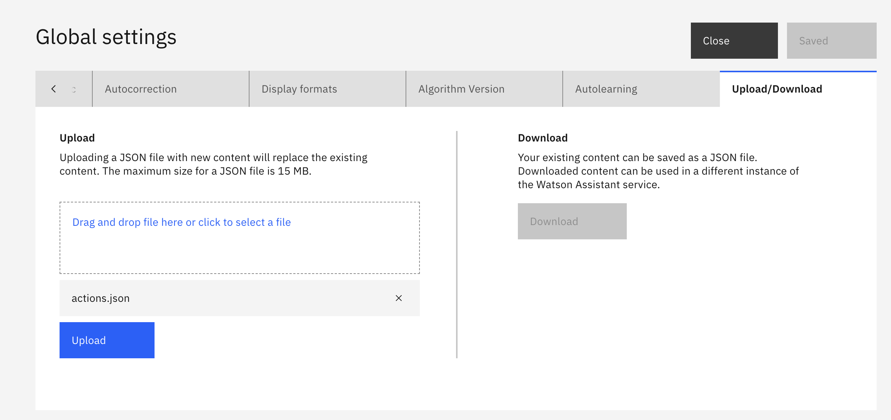
10. You will see a warning message. Click `Upload and replace`
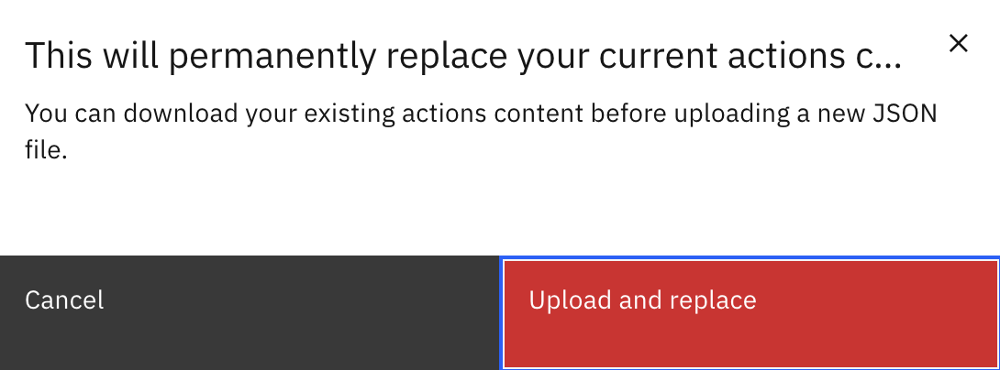
11. Now, close this page, and you will see the exported actions appear on your actions list.
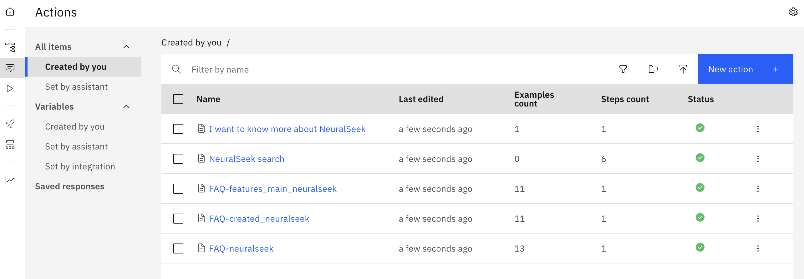
12. Click one of the actions. You should be able to see the list of the quesitons generated by NeuralSeek nicely populated. 
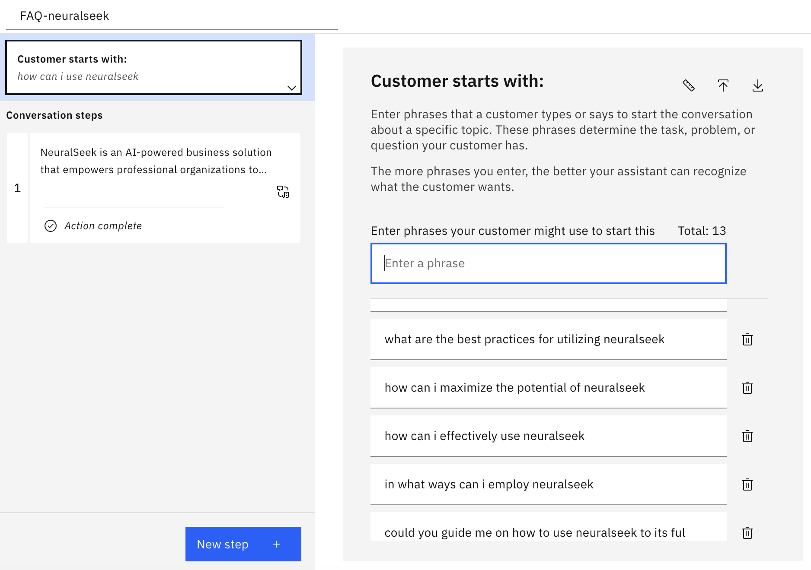
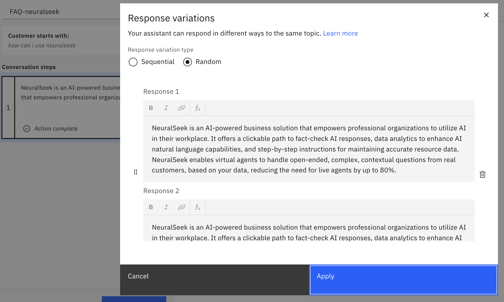

With these, you can easy save time to jump start Watson Assistant to provide better answers to the questions and answers generated by NeuralSeek. One other nice thing about this is that if you find any particular questions and answers that does not yet exist in Watson Assistant, you can easily move them from NeuralSeek.

#### Importing into Watson Assistant as Dialogs
> Unlike importing them as Actions, you first need to export your Watson Assistant's dialogs and set them as `Base Watson Assistant Dialog` into NeuralSeek. That is because Watson Assistant, when uploading a Dialog, would simply override the existing dialog and upload a new one. In order to make sure any existing actions or dialogs are not deleted, NeuralSeek needs to have it first, and then merge the dialogs into it.

1. Go to your Watson Assistant, and to go `Dialog > Options > Upload / Download`:
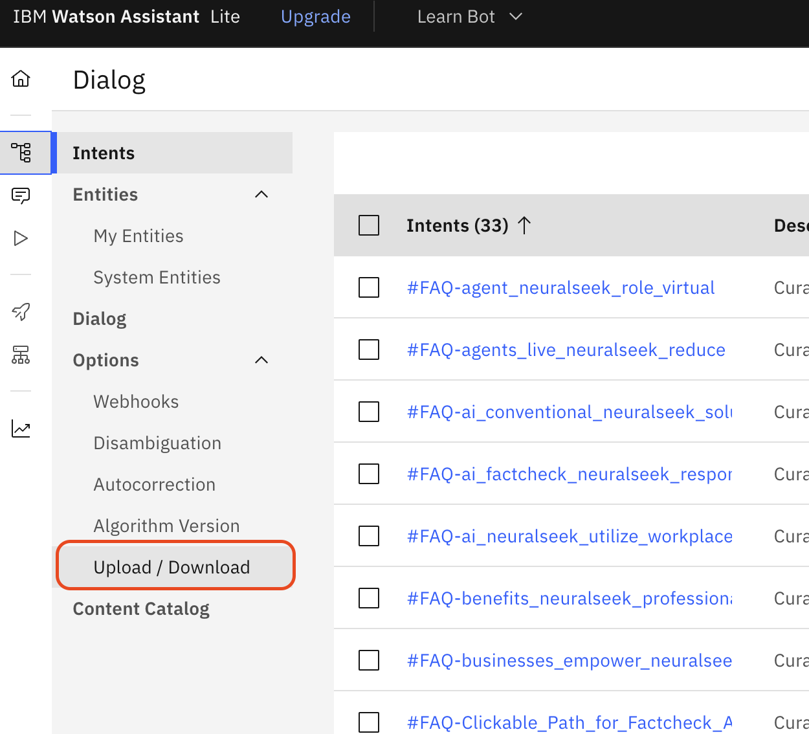
2. Click `Download` tab and click `Doanload` button:
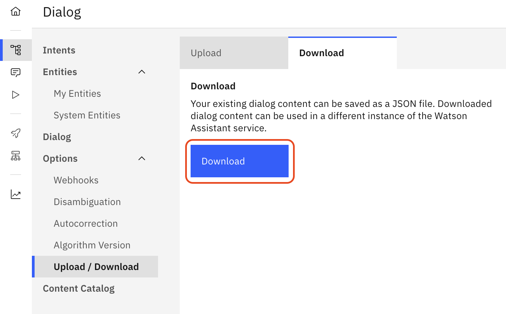
3. A JSON file should be downloaded.
4. Now go to NeuralSeek, and go to `Curate` tab.
5. Click `Import Base Watson Assistant Dialog` button.
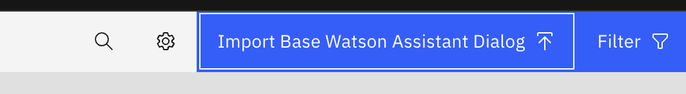
6. Select the downloaded JSON file. The button will now be turned to `Base Watson Assistant Dialog Uploaded`.
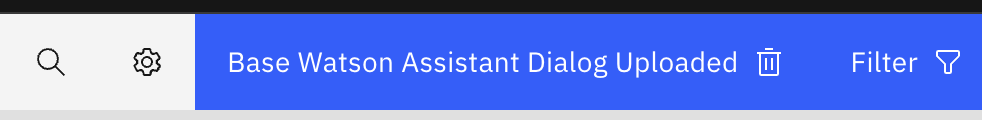
> ⚠️ whenever there is a change of your Watson Assistant Dialog, make sure to delete the older one and upload the recent one in order to not risk losing your most up-to-date dialogs.
7. Now, select the list of questions that you want to load it into. As soon as you select them, a new button `Export to Watson Assistant Dialog` will appear. You can obviously select all the questions by checking the `all` box at top left.
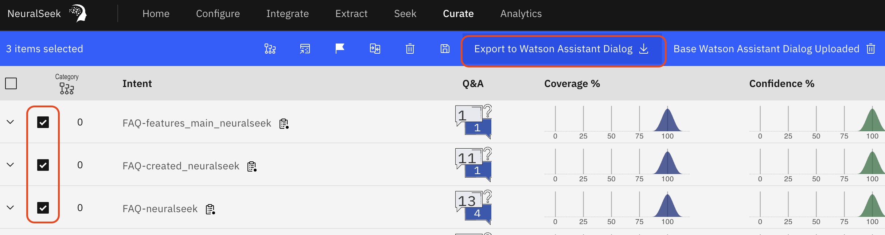
8. Click the button to export these dialogs.
9. Now, a JSON file should be downloaded. Load the file back into Watson Assistant using its upload tab.
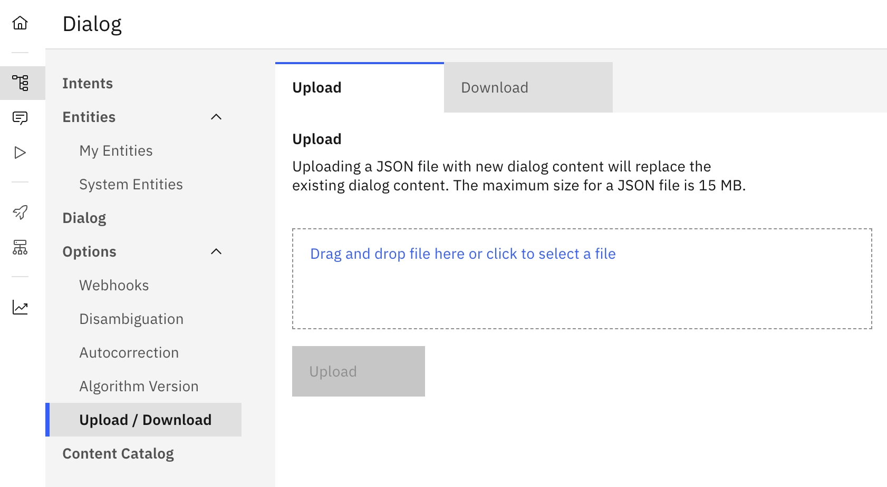
10. Note that uploading this JSON will overwrite any existing dialog contents. Click `Upload and replace`.
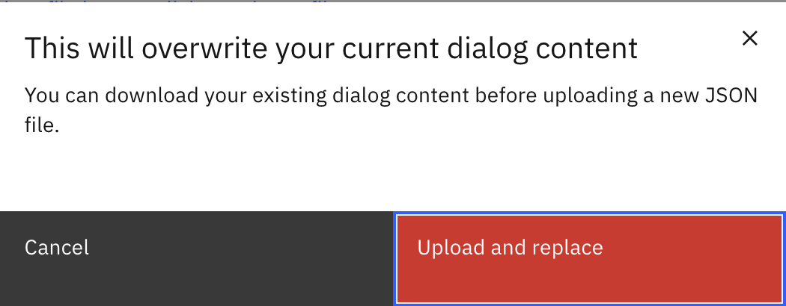
11. If everything goes well, it will say the skills were uploaded successfully.
12. You now have the curated answer from NeuralSeek populated as a Dialog node in Watson Assistant. Next time when the user asks the same question, Watson Assistant should be able to answer it the same way as NeuralSeek did.

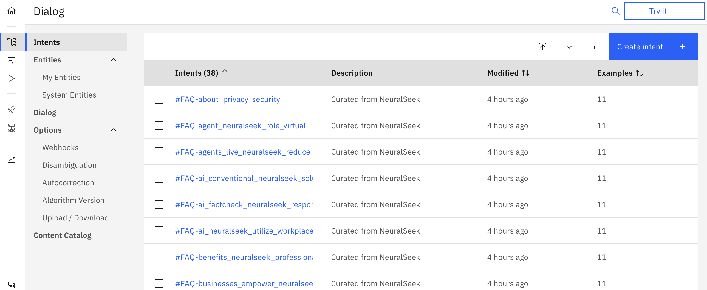
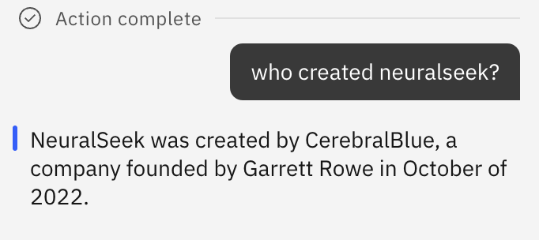

This is a great way to effectively manage some of the most frequent questions and answers that you uncover from NeuralSeek to be able to be transferred into the Virtual Agent's dialog, such that it will be able to be trained with better set of answers.
