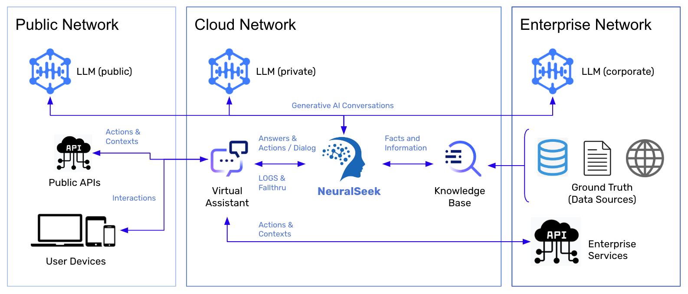

# Overview

NeuralSeek is an AI-powered Answers-as-a-Service, designed to enhance information sharing and customer support within organizations’ virtual agents. NeuralSeek works by leveraging the capabilities of a sophisticated Large Language Model(LLM) and the users’ corporate KnowledgeBase, allowing virtual agents to provide concise and contextually relevant responses to user queries.

NeuralSeek empowers businesses. Unlike most AI, NeuralSeek provides a clickable path to fact check AI generated responses, data analytics to improve AI natural language, and step-by-step instructions to use AI to clean and maintain accurate resource data. It is the business solution to use AI in a professional workplace.

By leveraging a comprehensive knowledge base, such as ElasticSearch or IBM Watson Discovery, NeuralSeek excels at answering user questions. What sets NeuralSeek apart from conventional AI solutions is its incorporated set of features. NeuralSeek offers a clickable path to fact-check AI response, utilization of data analytics to enhance AI natural language capabilities and comprehensive step-by-step instructions for maintaining accuracy and clean resource data. With these additional capabilities, NeuralSeek emerges as the ideal AI solution for empowering professional businesses.

# The creator

NeuralSeek was created in October of 2022, by CerebralBlue ([https://cerebralblue.com/](https://cerebralblue.com/)), which was founded by Garrett Rowe ([https://www.linkedin.com/in/garrettrowe](https://www.linkedin.com/in/garrettrowe)).
