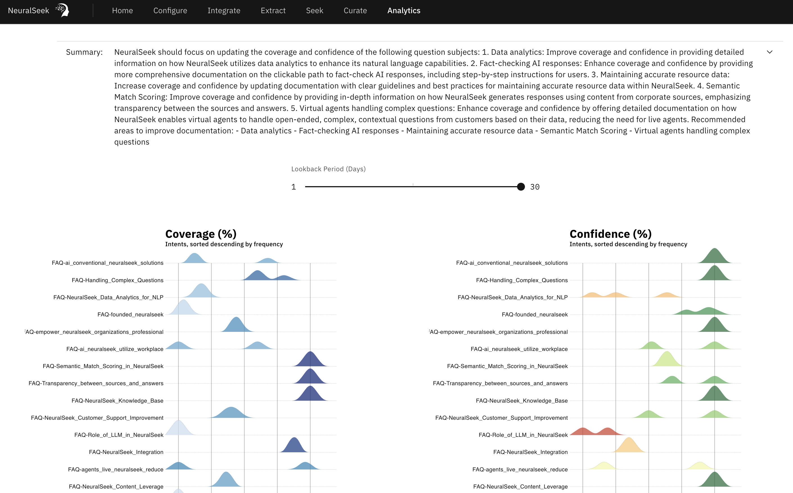

# Analytics

Users can work backwards from the Analytics tab to see and understand where the confidence and coverage scores of different actions are coming from. The analytics feature reveals the relationship between each action’s coverage and confidence scores, and can direct users to each specific action found in the “Curate” section of the UI.

You can see the changes up to 30 days, and also see the trend of whether the coverage or confidence has gone up or down in the past.

For auto-categorization of intents, check out [Intent Categorization]({{site.baseurl}})
