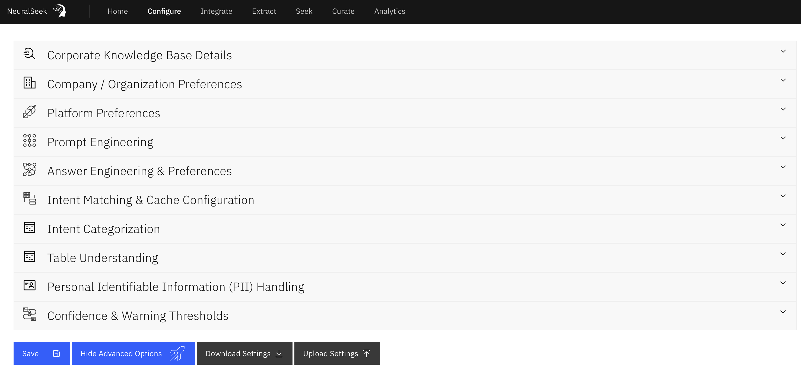

# Configure

This location of NeuralSeek is where users can edit the configurations for NeuralSeek’s features. There are two types of configurations: Default Configurations and Advanced Configurations.

## Default Configurations

- **Corporate KnowledgeBase Details:** users can change their KnowledgeBase type, the url and API key, adjust score settings (Document score range, Document date penalty), snippet size, and cache timeout for the cached content processed from KnowledgeBase. Currently three types of KnowledgeBase are supported:
    - Watson Discovery
    - Watson Discovery CP4D (CloudPak for Data)
    - Elastic AppSearch
- **LLM Details:** This is where users can set or modify their LLM model settings, such as URL for the model endpoint, and API keys. **This section is only available if you are using BYOLLM (bring your own LLM) plan of NeuralSeek**.
- **Company/Organization Preferences:** This is where you can enter your company name, and description of what the company primarily focuses on. Note that the description is also used as a `stump speech` which is a block of text to be used to help generate a response when all else fails, and the answer needs to fall back to it.
- **Platform Preferences:** This is where you can set up your primary default language (e.g. English), whether the response would contain the embedded link into returned responses, and also virtual agent type that NeuralSeek can generate its questions and answers to. Currently the following virtual agent types are supported:
    - AWS Lex V2
    - Azure Knowledge Base
    - Cognigy
    - Kore.ai
    - Watson Assistant Action
    - Watson Assistant Dialog
    - Web HTML (None)
- **Intent Categorization:** This is where you can create type of categories and their descriptions to control how some of the intents in user question can be categorized into. Usually a question would be automatically categorized as `FAQ` , but you can provide additional ones here.
- **Confidence & Warning Thresholds:** Adjust misinformation tolerance, warning confidence, semantic score, minimum confidence, minimum text, maximum length, and various penalty score ranges.

## Advanced Configurations

- **Prompt Engineering:** Prompt Engineering allows expert users to inject specific instructions into the LLM prompt. Most use cases will not need this and should not use this. EG: do not enter "provide factual information" or "act as a helpful customer support agent". NeuralSeek's extensive prompting already does this. Do not casually enable, as you can weaken the safeguards and extensive prompting that NeuralSeek provides out-of-the-box.
- **Answer Engineering & Preferences:** Here, you can set whether the answer generation would stick to being concise, or can have more freedom to be flexible. Also, as part of answer engineering, you can provide regular expression and replacement pair so that certain pattern of data or sensitive information can be replace or removed as necessary.
- **Intent Matching & Cache Configuration:** Here is where you can configure strategies to perform intent matching. The following types are available: Exact, Fuzzy, Keyword, and Fuzzy Keyword. You can also configure how the answer caching is to be done for edited answers, and normal answers. You can control the number of answers that would trigger the cache, as well as their individual matching methods.
- **Table Understanding:** Table understanding pre-processes your documents to extract and parse tabular data into a format suitable for conversational query. Since this preparation process is both costly and time consuming, this feature is opt-in and will consume 1 seek query for every table preprocessed. Web Crawl Collections are not eligible for table understanding, as the re-crawl interval will cause excessive compute usage. Table preparation time takes several minutes per page. Please contact [cloud@cerebralblue.com](mailto:cloud@cerebralblue.com) with details of your opportunity and use case to be considered for access.
- **Personal Identifiable Information (PII) Handling:** Here, you can define how to handle any detected PII data that was included in the question. The following options are available: Mask, Flag, No Action, Hide (retain for Analytics), and Delete. The configuration also lets you add any particular examples of PII data, so it can be better detected, or set as `No PII` so that it can be ignored.