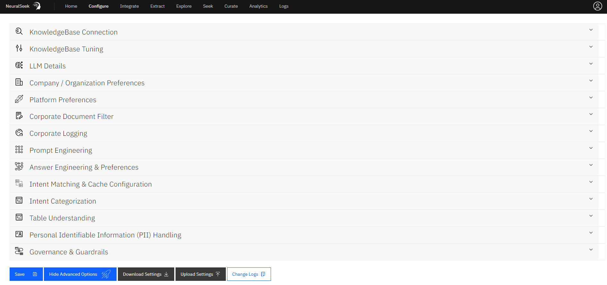

# Configure

This location of NeuralSeek is where users can edit the configurations for NeuralSeek’s features. There are two types of configurations: Default Configurations and Advanced Configurations.

## Default Configurations

- **KnowledgeBase Connection:** Users can change their KnowledgeBase type along with the associated url, API keys, project ID, and other relevant information. Use the drop down arrows to manually configure the fields of the schema in the connected KnowledgeBase.
    - **Curation data field:** select where your FAQ content/document body is located.
    - **Document name field:** select what is displayed for the title.
    - **Link field:** select the URL below the title, or what will be served in the Virtual Agent chat bubble as a link.
    - **Filter field:** select the field you want to filter by. For example, you can filter for a specfic document type in your KnowledgeBase and only return PDF's.
      
  Users have the option to enable or diasble attributing sources inside LLM context by document name. For example, when disabled the output will be formatted with only the document contents. When enabled, the output will be formatted with an introductory sentance that attritubes the 'document content' to the appropriate document 'name' (e.g. "The document 'name' states that: 'document content').
  
  Users are able to enter a prioritized list of values that you want to re-rank above other results, regardless of KB score. This can be modified under the Re-Sort values list menu.
  
  See our supported [KnowledgeBase page]({{site.baseurl}}) for more information on supported KnowledgeBases.
  
- **LLM Details:** This is where users can add a LLM of choice, and set or modify their LLM model settings. By clicking "Add an LLM", users will be prompted to select an LLM from their platform of choice and enter the relevant information such as API keys, endpoint URLs, project ID's, etc. Use the drop down arrow to enable languages of choice: there are a total of 56 supported LLM languages. Users can also modify which NeuralSeek functions to enable for the added LLM. Note that you must add at least one LLM. If you add multiple, NeuralSeek will load-balance across them for the selected functions that have multiple LLM's. Features that an LLM are not capable of will be unselectable. If you do not provide an LLM for a function, there is no fallback and that function of NeuralSeek will be disabled. 
> **This section is only available if you are using BYOLLM (bring your own LLM) plan of NeuralSeek**.

- **Company/Organization Preferences:** This is where you can enter your company name, and description of what the company primarily focuses on. Note that the description is also used as a `stump speech` which is a block of text to be used to help generate a response when all else fails, and the answer needs to fall back to it. Users can also select whether to add or not add Company Response Affinity which adds affinity to the company on top of any affinity that may be already present in your KnowledgeBase and Stump Speeches.
  
- **Platform Preferences:** This is where you can set up your primary default language (e.g. English), whether the response would contain the embedded link into returned responses, a list of custom stopwords if you want to override the NeuralSeek default stopwords, and also a virtual agent type that NeuralSeek can generate its questions and answers to. See our supported [Virtual Agent platforms page]({{site.baseurl}}).
  
- **Intent Categorization:** This is where you can create type of categories and their descriptions to control how some of the intents in user question can be categorized into. Usually a question would be automatically categorized as `FAQ` , but you can provide additional ones here.
  
- **Governance & Guardrails:** Users are able to adjust the following:
    - **Attribute Checking:** Adjust misinformation tolerance for generating text about the company, or associating people or things that lack specific references in the KnowledgeBase material by using the sliding scale from "Rigid" to "Standard". The more rigid your setting, the higher the chances of occasionally blocking legitimate questions that use alternate wording or are poorly documented in your KnowledgeBase. 
    - **Semantic Score:** The Semantic Score model checks the generated answer against the KnowledgeBase sources, and rates the answer based on the quantity and focus of the KnowledgeBase and Stump Speech source documentation (e.g. is the answer primarily formed from a single source or many?) Toggle the icons to enable or disable the Semantic Score Model, using Semantic Score as the basis for Warning & Minimum confidence (e.g. Do NOT Enable for usecases requiring language translation), reranking the search results based on the Semantic Match, and checking the document titles and URL's as part of the Semantic Match. Note that semantic scoring will not be accurate when getting answers in a diferent language than your KnowledgeBase source docs.
        - **Semantic Model Tuning:** use the sliding scales to further tune the Semantic Match.
            - **Missing key search term penalty:** After scoring, this penalty is applied for answers that are missing KnowledgeBase attribution of *proper* nouns that were included in the search. 
            - **Missing search term penalty:** After scoring, this penalty is applied for answers that are missing KnowledgeBase attribution of *other* nouns that were included in the search. 
            - **Source Jump penalty:** When anwers join across many source documents it can be an indication of lost meaning or intent, depending on your source documentation. 
            - **Total Coverage weight:** Looking at the answer, how much weight should be given to the total coverage alone, regardless of other penalty. Increasing this helps prevent abnormally low scores from long, highly-stitched answers. Decreasing will better catch hallucination in short answers. 
            - **ReRanK Min Coverage %:** What is the minimum coverage of the total answer that the top *used* source document needs to be reranked over the top *KB-scored* document. 
    - **Profanity Filter:** Users are able to toggle the icon to enable or disable the profanity filter, as well as add a text to reply with for sensitive questions that are blocked. (e.g. "That seems like a sensitive question.  Maybe I'm not understanding you, so try rephrasing.").
    - **Warning Confidence:** Use the sliding scale to increase the confidence percentage for warning. Add a text to prepend a warning on low confidence results. (e.g. "I'm not an expert in this, but...").
    - **Minimum Confidence:** Use the sliding scale to increase the minimum confidence percentage and the minimum confidence percentage to display a URL. Add a text to reply with for questions not meeting the minimum confidence, and select whether to add a URL fallback on minimum. (e.g. "There is nothing in our knowledge base about that."). 
    - **Minimum Text:** Use the sliding scale to set a desired minimum amount of words in a question. Add a text to reply with for questions not meeting the minimum input text length. (e.g. "Give me a bit more to go on...").
    - **Maximum Length:** Use the sliding scale to set a desired maximum amount of words in a question. Use a low limit to help mitigate adversarial questions designed to generate inappropriate answers. Set to 100 to remove the limit. Add a text to reply with for questions over the input word limit. (e.g. "Can you please summarize your question for me?  Questions should be limited to 20 words."). 

## Advanced Configurations

- **KnowledgeBase Tuning:** Tuning your Knowledgebase is an important part of creating a well performing system. Start by entering a seek query on the Seek tab to review the answer provided, as well as look at the documentation in the accordions below the answer. If the answer is not suitable for your needs, first check if the top document is correct and complete. If not, adjust snippet size by using the slider bars to improve KB training. Secondly, check if your answers are bringing back more irrelevant documentation than you need. If so, use the slider bars to set a max documents per seek or use the sliding scale to set a lower document score upper range. Further, you can adjust the document date penalty to ensure relevancy, and adjust the cache timeout in minutes but using the KnowledgeBase Query Cache (minutes) sliding scale.

- **Prompt Engineering:** Prompt Engineering allows expert users to inject specific instructions into the LLM prompt. Most use cases will not need this and should not use this. (e.g. do not enter "provide factual information" or "act as a helpful customer support agent".) NeuralSeek's extensive prompting already does this. Do not casually enable, as you can weaken the safeguards and extensive prompting that NeuralSeek provides out-of-the-box. Do not use any language other than English in prompt engineering.
  
- **Answer Engineering & Preferences:** Users are able to use the sliding scale to set whether the answer generation would stick to being concise, or can have more freedom to be flexible. Toggle the icon to True or False to force answers from the Knowledgebase if desired. Also, as part of answer engineering, you can provide regular expression and replacement pair so that certain pattern of data or sensitive information can be replace or removed as necessary. Answer Engineering uses Javascript Regular Expressions to selectivley replace text in both the KnowledgeBase training data and the live generated answer. (e.g. Use this to remove or swap phone numbers, emails, etc.). 
  
- **Intent Matching & Cache Configuration:** Here is where you can configure strategies to perform intent matching. The following types of intent match's are available: Exact Match, Vector Similarity, Fuzzy Match, Keyword Match, and Fuzzy Keyword Match. Users can also configure how the answer caching is to be done for edited answers, and normal answers. You can control the number of answers that would trigger the cache, as well as their individual matching methods by using the sliding scales. Toggle the icon to Yes or No if desired to require the cache to follow context as well.
  
- **Table Understanding:** Table understanding pre-processes your documents to extract and parse tabular data into a format suitable for conversational query. Since this preparation process is both costly and time consuming, this feature is opt-in and will consume 1 seek query for every table preprocessed. Web Crawl Collections are not eligible for table understanding, as the re-crawl interval will cause excessive compute usage. Table preparation time takes several minutes per page. Please contact [cloud@cerebralblue.com](mailto:cloud@cerebralblue.com) with details of your opportunity and use case to be considered for access.
> Note that Table Understanding requires a compatible LLM with Table Understanding Enabled. Not all LLM's are capable of Table Understanding.

- **Personal Identifiable Information (PII) Handling:** Users can define how to handle any detected PII data that was included in the question. The following options are available: Mask, Flag, No Action, Hide (retain for Analytics), and Delete (including from Analytics). The configuration also lets you add any particular examples of PII data, so it can be better detected, or set as `No PII` so that it can be ignored.
  
- **Corporate Document Filter:** Connect NeuralSeek to an external corporate rules engine to filter allowed documentation by user. Each request will send the id's of the found documentation to a endpoint you set here. Any ID's not returned back from the corporate filter will be blocked. Toggle the icon to Enable to Disable this feature. If enabled, fill out all relevant information including: Base URL for the corporate filter (get), URL paramenter for the UserName, URL paramenter for the KB field, and the Knowledgebase field to send.
  
- **Corporate Logging:** Connect NeuralSeek to a corporate audit logging endpoint. When connected and enabled, all requests and responses to the Seek api endpoint, as well as the Curate tab will be logged to your elasticSearch instance. Toggle the icon to Enable to Disable this feature. If enabled, fill out all relevant information including: ElasticSearch Endpoint and ElasticSearch API Key. 

## Advanced Setting Options

- **Download Settings:** Click this to download a .dat copy of all settings in the configure tab to your local machine.
- **Upload Settings:** Click this to upload and restore settings from a .dat copy backup of all settings in the configure tab from your local machine.
- **Change Logs:** Click to view the change log history of all settings changed in this instance for auditing and debugging purposes.
