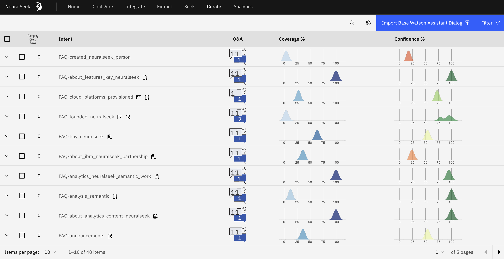

# Curate

This is where to view intents generated from the KnowledgeBase, import and export intents into the assistant, manage example questions and answers, and . The intent content and parameters can be adapted and adjusted to accommodate employee and customer needs.

Users can also view the results of other features as well, such as round trip logging, merge/unmerge actions, whether the intent contains any PII information, and whether the source knowledge base information has changed so that user can easily detect whether the answer that were generated needs to be updated or not.