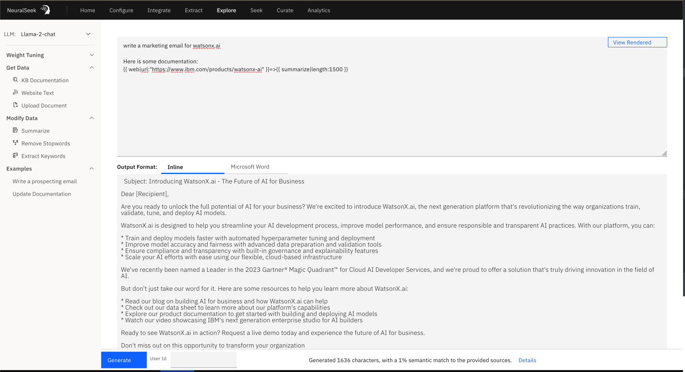
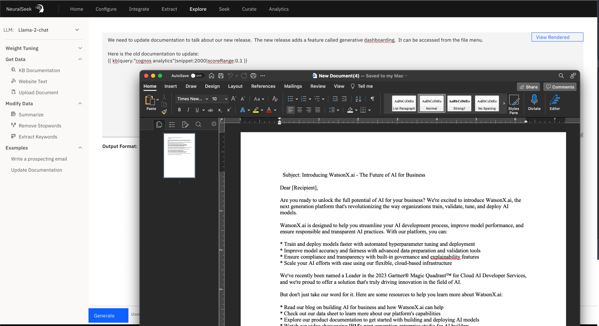

Introducing "Explore" - an open-ended retrieval augmented generation playground designed to enhance your experience with Large Language Models (LLMs). 

Explore is a practical tool that provides you with the following capabilities:
1. Choice of LLM: Select your preferred LLM, and seamlessly integrate it with Explore. 
2. Utilize NeuralSeek Template Language (NLT): Craft dynamic prompts using a combination of regular words and NLT markup to retrieve content from different sources.
3. Versatile Content Retrieval: Retrieve data from various sources, including Knowledge Bases, websites, local files (PDFs, Docs, CSVs, XLS, TXT), or input your own text.
4. Content Enhancement: Improve your data with features like summarization, stopwords removal, and keyword extraction, ensuring your content is refined and valuable.
5. Guided Prompts: Explore provides guidance on LLM prompt syntax and optimal weights to achieve the best results. 
6. Effortless Output: Easily view your generated content within the built-in editor or export it directly to a Word document, offering convenient control over your output.

<!--EG: This NTL prompt grabs a webpage, extracts the core text of the page eliminating junk, then summarizes the page down into ~1500 chars, then sends it to the LLM-->
## A Practical Use Case

Consider a scenario where you need to extract valuable information from a webpage. With "Explore," you can create an NLT prompt that retrieves the essential content, eliminates irrelevant material, summarizes it to approximately 1500 characters, and sends it to the LLM:
```
write a marketing email for watsonx.ai
Here is some documentation:
{{ web|url:"https://www.ibm.com/products/watsonx-ai" }}=>{{ summarize|length:1500 }}
```

<!--And this one queries the KB, while dynamically setting score and snippet overrides, then sends it to the LLM-->
Explore has the ability to perform Knowledge Base (KB) queries while dynamically configuring scoring parameters and snippet overrides. It then seamlessly transfers the processed data to the Language Model (LLM).
```
We need to update documentation to talk about our new release.  The new release adds a feature called generative dashboarding.  It can be accessed from the file menu.
Here is the old documentation to update:
{{ kb|query:"cognos analytics"|snippet:2000|scoreRange:0.1 }}
```

<!--And of course all of this bounces against our Semantic Scoring model, so you can take a quick pulse on how much got imagined, depending on your personal need or tolerance.-->
## Precision with Semantic Scoring

Furthermore, it's important to highlight that all these operations are evaluated against our Semantic Scoring model. This means that you have the ability to gauge the extent of content generation based on your specific requirements or threshold, providing valuable insight into the scope of generated content tailored to your preferences.
