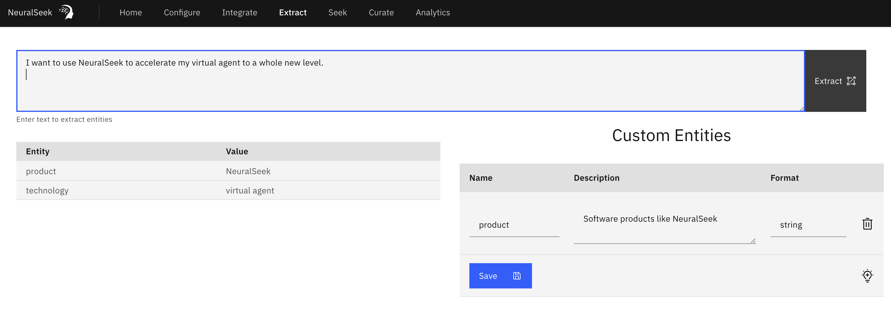

# Extract

Extract lets user extract detected `entities` found inside a user provided text. The interface would let user enter texts, and from there it will automatically try to extract found entities and provide its list. You can also add, update, or delete any number of `custom entities` that you may want to specify certain entities better or create a new type of entity. For more information, see [entity extraction](https://www.notion.so/Entity-Extraction-2d89cb0f4bbf46a1a72b8f9453359998?pvs=21).