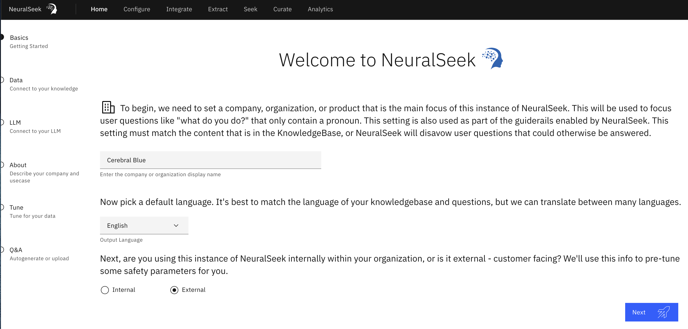

# Home

The home page is where users can get started interacting with NeuralSeek and quickly set up a chatbot in a matter of moments (see NeuralSeek onboarding).

- **Basics**: User provides general information about their organization with NeuralSeek.
- **Data**: Where users connect to their KnowledgeBase (can also be done under the “Configure” tab).
- **LLM**: (only available with Bring Your Own LLM plan) User can select their preferred LLM (Large Language Model) of choice. User is required to enter the appropriate integration information (e.g. API key of their LLM) in order to continue.
- **About:** Describing the organization and use case preferences.
- **Tune:** Provide information about the documentation/KnowledgeBase.
- **Q&A:** Auto-generate a list of actions to set up a virtual agent in minutes.

User can also perform the following actions through the home page:

- **Auto-generate questions**: Virtual Agents would typically require an adequate number of questions for creating meaningful intentions and dialogs. This process would typically involve having to manually create them. However, NeuralSeek can generate, based on the contents of your KnowledgeBase, a good set of commonly asked questions for you.
- **Manually Input questions**: If you already have a good set of questions that your user frequently asks, you can upload them into NeuralSeek and NeuralSeek could categorize and create their answers for you to later review and curate them.
- **Upload Test questions**: If you want to test out your set of questions, and validate whether their coverage or confidence score is good enough, or find out how their analytics look like, use this. A template CSV file is given for you to use it.
