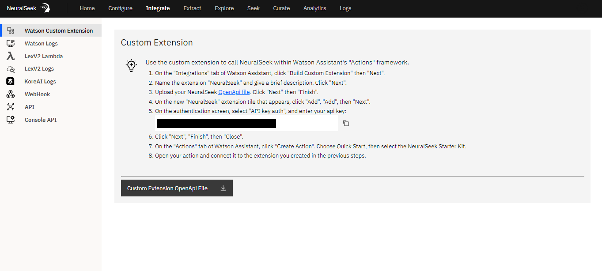

# Integrate

- **Custom Extension:** This contains the information to build a custom NeuralSeek extension within Watson Assistant.
- **LexV2 Lambda:** Use the AWS Lambda to send user input that routes to the Lex FallbackIntent to NeuralSeek. Used in conjunction with AWS LexV2.
- **LexV2 Logs:** How to enable Round-Trip Logging using LexV2 Logs, to monitor the usage of curated intents. The purpose of round-trip logging is to improve the virtual agent’s performance by analyzing the data and identifying areas for improvement.
- **Watson Logs**: How to enable Round-Trip Logging using Watson Logs, to monitor the usage of curated intents. The purpose of round-trip logging is to improve the virtual agent’s performance by analyzing the data and identifying areas for improvement.
- **WebHook**: This is the backbone of NeuralSeek, how users connect and communicate with the solution. One can make a call to this WebHook from any applications (e.g. slack, servicenow, etc.) that can foward its question to it and receive answers from.
- **API (REST)**: Where to find necessary information regarding how to invoke NeuralSeek’s REST API, and navigate and test it right on its openAPI generated page. You can get examples of JSON message requests and responses, as well as JSON schema of the message payloads.
- **KoreAI**: Activate Round-Trip monitoring for deployed NeuralSeek Intents. This feature enables NeuralSeek to continuously monitor the usage of its curated intents through KoreAI event Tasks. It will promptly alert you if any curated intents require updates due to changes in the associated KnowledgeBase documents.
- **Console API**: This integration allows users to access debugging and monitoring features conveniently from within the NeuralSeek application, simplifying tasks such as error identification, performance analysis, and data insights without the need to switch between different tools or interfaces. It enhances the user experience by providing seamless access to the Console API's functionality within NeuralSeek's interface, streamlining development and monitoring tasks
