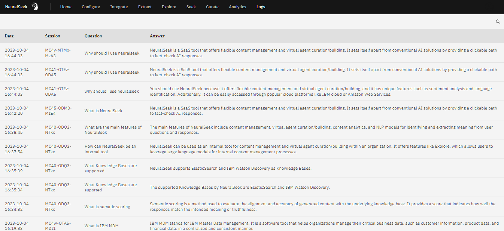

# Logs

In NeuralSeek, users can access the usage log generated from interactions with the "Seek" feature through the "Logs" tab. This feature allows users to efficiently filter their log history by date, session ID, question, and answer for a more streamlined and informative experience.
