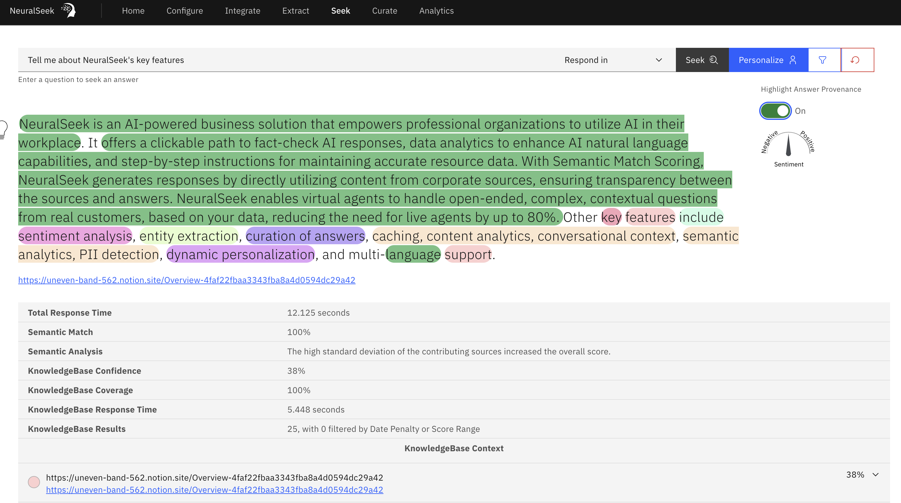

# Seek

Users can test questions and answers in the “Seek” section, as well as change the language/utilize the Match Input Feature, and see where their answers are coming from within their KnowledgeBase.

Highlight Answer Provenance: Enabling this feature reveals how the majority of responses are formed by the trained answer and additional components that came in from the KnowledgeBase itself.

Users can personalize and filter through their KnowledgeBase documents on the Seek tab as well.

For more information, see [Semantic Analytics](https://www.notion.so/Semantic-Analytics-237a4a6d3c124be4b473ca49ed7a662a?pvs=21).