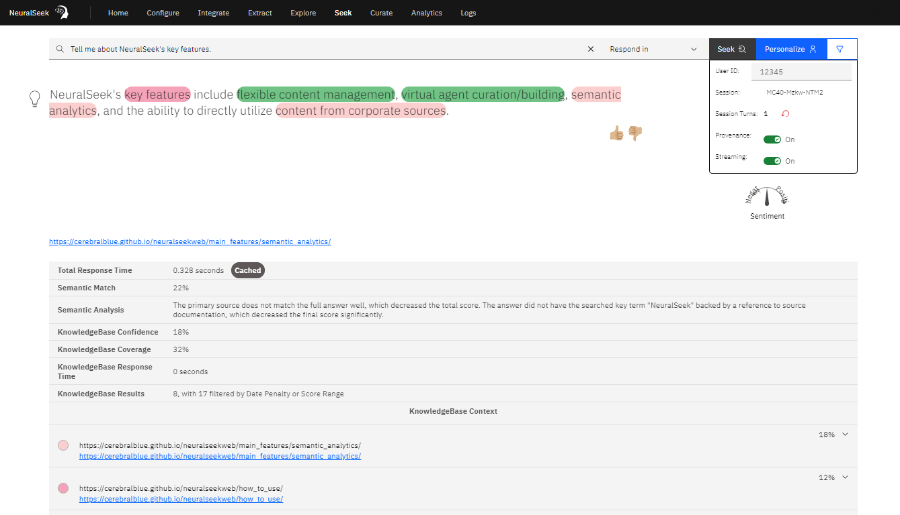
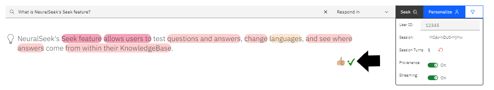
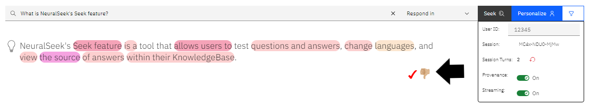
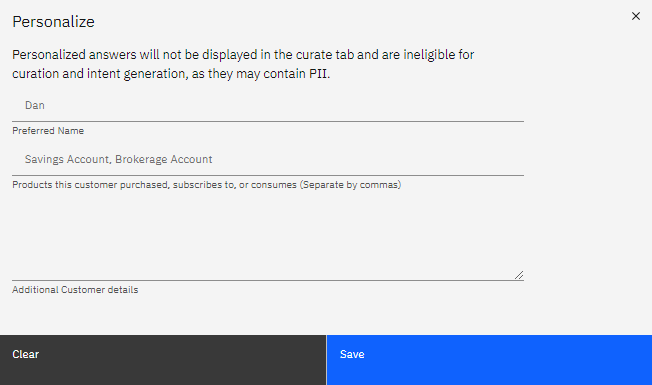
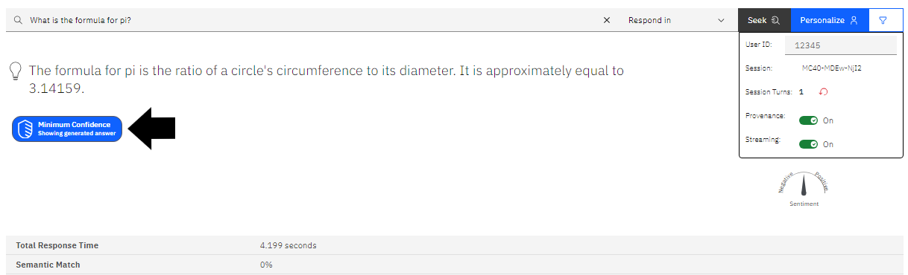

# Seek

NeuralSeek’s "Seek" feature enables users to test questions and generate answers using content from their connected KnowledgeBase. To ensure transparency between the sources and answers, NeuralSeek highlights where the answers are coming from within the KnowledgeBase. Semantic match scores are employed to compare the generated responses with the original documentation, providing a clear understanding of the alignment between the response and the meaning conveyed in source documents. This process ensures accuracy and instills confidence in the reliability of the responses generated by NeuralSeek.

## Features

**User ID**: Users are able to view and set a User ID to test conversations. 

**Session ID**: A unique "Session ID" number is generated. Users are able to revert to a new session with a unique "Session ID" number by clicking the red arrow next to "Session Turns".  

**Session Turns**: A "Session Turns" number is generated, which allow the user to view how many turns were generated in the corresponding Session ID. 

**Highlight Answer Provenance**: Enabling this feature reveals how the majority of responses are formed by the trained answer and additional components that came in from the KnowledgeBase itself. Users are able to enable or disable.

**Answer Streaming**: Streaming is available to enable or disable. Enabling this feature allows for the reponse to be generated word-by-word. Disabling this feature allows for the whole response to be generated at once. 

## Information Output

| **Total Response Time**         | This number indicates the total amount of time for a response to generate in seconds. | 
| **Semantic Match %**            | This percentage is the overall match score that indicates how much NeuralSeek believes that the responses are well aligned with the underlying ground truth from the KnowledgeBase. The higher the percentage is, the more accurate and relevant the answer is based on the truth. 
| **Semantic Analysis**           | A summary describing why NeuralSeek calculated the matching score in an easy-to-understand syntax. This gives users a good understanding why the answer was given either a high or low score.
| **KnowledgeBase Confidence %**  | This percentage indicates how confident the KnowledgeBase thinks the retrieved sources are related to the given question.
| **KnowledgeBase Coverage %**    | This percentage indicates how much coverage the KnowledgeBase thinks the retrieved sources are related to the given question.
| **KnowledgeBase Response Time** | This number indicates the amount of time for the KnowledgeBase to generate a response in seconds. 
| **KnowledgeBase Results**       | This number indicates the amount of retrieved sources the KnowledgeBase thinks are related to the given question.

## Other Uses

Users are able to provide feedback on answers by clicking the "Thumbs Up" or "Thumbs Down" icons. 

Users can personalize and filter through their KnowledgeBase documents on the Seek tab as well.

Users are able to see what an answer would have been when using the "minimum confidence" icon on low semantic match scored Seek's.

> For more information, see [Semantic Analytics]({{site.baseurl}}).
